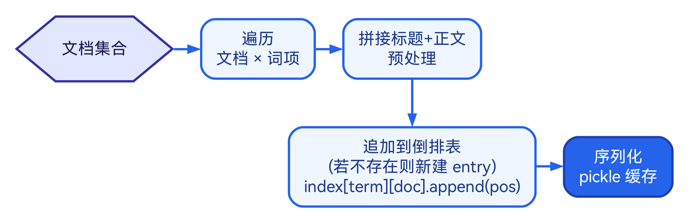
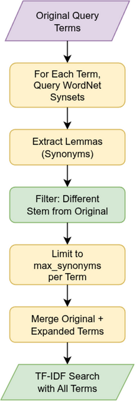
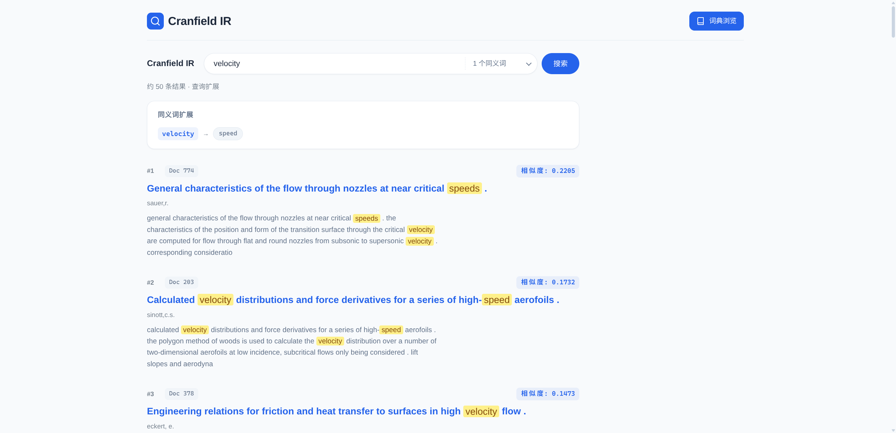
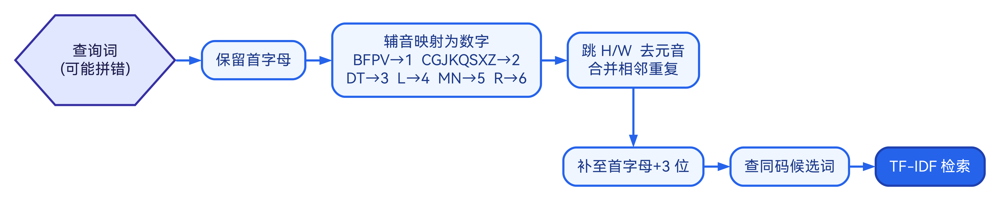
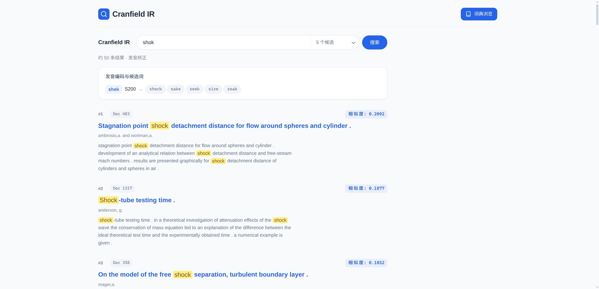
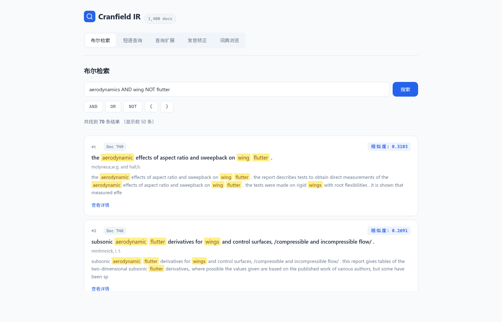
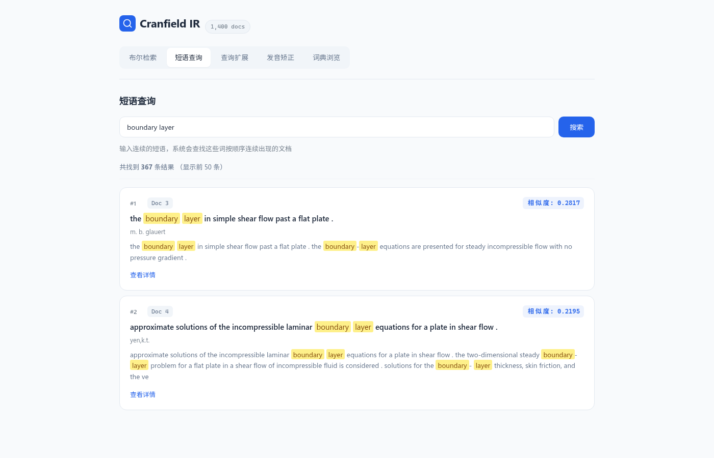
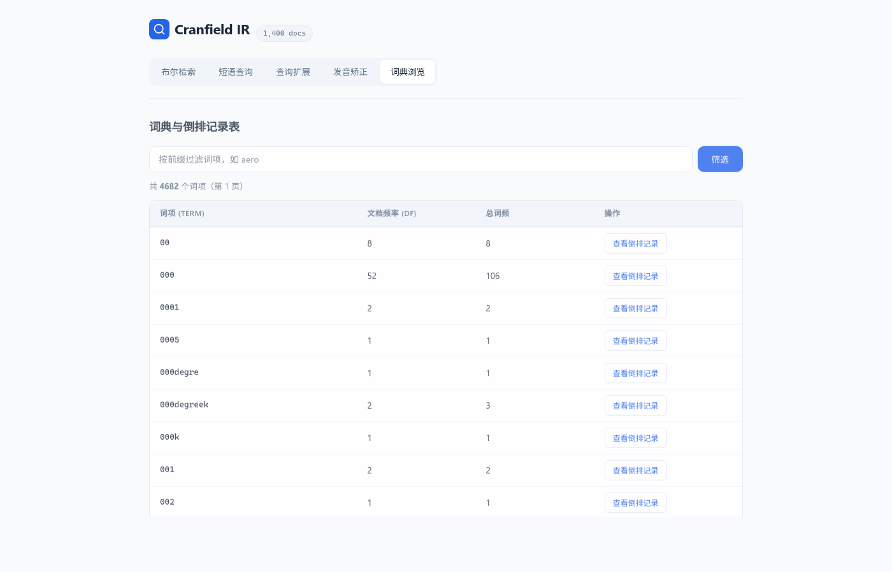

## 摘　要

本课程设计基于经典的 Cranfield 信息检索测试集（1400 篇航空动力学论文摘要），设计并实现了一个完整的搜索引擎系统。系统后端采用 Python FastAPI 框架，前端采用 Vue 3 构建 Web 界面。在数据预处理阶段，对英文文档进行小写化、去标点、分词、去停用词和 Porter 词干提取，生成包含位置信息的倒排索引。系统实现了三种检索方式：基于递归下降解析器的布尔检索（支持 AND、OR、NOT 及括号嵌套）、基于位置信息的短语查询、以及基于 WordNet 的同义词查询扩展。所有检索结果均采用 TF-IDF 向量空间模型计算余弦相似度进行排序，并在 Web 界面中对匹配词项进行高亮显示。此外，系统提供了词典浏览和倒排记录表查看功能，便于直观理解索引结构。实验结果表明，系统能够有效地对 Cranfield 数据集进行多模式检索，验证了布尔模型、向量空间模型等经典信息检索理论的实际效果。

**关键词：** 信息检索；倒排索引；TF-IDF；布尔检索；查询扩展

\newpage

## Abstract

This course project designs and implements a complete search engine system based on the classic Cranfield information retrieval test collection, which comprises 1,400 aerospace engineering paper abstracts, 225 standard queries, and 1,837 human-annotated relevance judgments. The backend is built with Python FastAPI, while the frontend is developed using Vue 3 as a single-page application. During the data preprocessing stage, English documents undergo lowercasing, punctuation removal, tokenization, stop word removal, and Porter stemming to produce a position-aware inverted index containing 4,682 unique terms. The system supports four retrieval modes: Boolean search based on a recursive descent parser (supporting AND, OR, NOT operators and nested parentheses), phrase search utilizing positional information for consecutive term matching, query expansion leveraging the WordNet lexical database for synonym-based retrieval enhancement, and Soundex phonetic correction for spelling-tolerant lookup. All search results are ranked by cosine similarity computed from the TF-IDF vector space model, with matching terms highlighted in the web interface. Additionally, the system provides dictionary browsing and posting list inspection functionalities, enabling users to interactively explore the underlying index structure. Experimental results demonstrate that the system effectively performs multi-mode retrieval on the Cranfield dataset, validating the practical effectiveness of classical information retrieval theories including the Boolean model and the vector space model.

**Keywords:** Information Retrieval; Inverted Index; TF-IDF; Boolean Retrieval; Query Expansion

\newpage

## 1 搜索引擎概述

### 1.1 搜索引擎的定义

搜索引擎是一种从大规模文档集合中根据用户查询检索相关信息的系统[1]。其核心功能包括文档的采集与存储、索引的构建、查询的处理以及结果的排序与呈现。现代搜索引擎通常包含爬虫（Crawler）、索引器（Indexer）、检索器（Retriever）和排序器（Ranker）等关键组件[1]。从广义上看，搜索引擎不仅包括面向互联网的通用搜索引擎（如 Google、百度），也包括面向特定领域的垂直搜索引擎（如学术搜索、电商搜索）以及企业内部的文档检索系统。无论应用场景如何变化，搜索引擎的核心目标始终是帮助用户从海量信息中快速、准确地找到所需内容。

信息检索（Information Retrieval, IR）作为搜索引擎的理论基础，研究如何从大规模非结构化数据（主要是文本）中找到满足用户信息需求的材料[2]。信息检索领域的研究涵盖文本表示、索引构建、查询处理、相关性排序等多个方面，为现代搜索引擎的发展提供了坚实的理论支撑。

### 1.2 搜索引擎的国内外发展现状

#### 1.2.1 国内搜索引擎

国内搜索引擎市场以百度为主导，同时搜狗、360 搜索等也占有一定的市场份额，形成了多元竞争的格局。

**百度搜索**是中国最大的搜索引擎，自 2000 年成立以来，在中文信息检索领域积累了深厚的技术储备[3]。百度在中文分词方面投入了大量研究，针对中文没有天然词边界的特点，开发了基于统计语言模型和深度学习的分词系统，能够准确处理歧义切分和新词识别等难题。在知识图谱方面，百度构建了大规模中文知识图谱，将实体识别、关系抽取和知识推理技术应用于搜索结果的增强展示，用户搜索特定实体时可以直接在搜索页面看到结构化的知识卡片。近年来，百度积极推进大语言模型在搜索中的应用，推出了基于文心大模型的 AI 搜索功能，能够对用户的复杂问题进行语义理解并生成综合性的回答。

**搜狗搜索**的独特优势在于其与搜狗输入法的深度联动。搜狗输入法拥有庞大的用户基础，通过分析用户的输入行为和搜索习惯，搜狗能够更精准地理解用户意图。搜狗搜索在微信公众号内容的检索方面具有独家优势，能够索引和检索微信公众号的文章内容，这是其他搜索引擎难以覆盖的内容来源。此外，搜狗在语音搜索和图片搜索等多模态检索方面也进行了积极探索，将语音识别和图像理解技术融入搜索产品。

**360 搜索**依托 360 安全浏览器的用户基础迅速崛起，在安全搜索方面具有特色。360 搜索强调对恶意网站和虚假信息的过滤，利用 360 安全大数据对搜索结果进行安全评估和标注。在技术层面，360 搜索在网页去重、反作弊和搜索结果多样性等方面持续投入，力求为用户提供更安全、更可信的搜索体验。

#### 1.2.2 国外搜索引擎

国外搜索引擎从目录式检索到全文检索，再到语义理解经历了深刻变革。

**Google** 是全球最具影响力的搜索引擎，其成功始于 1998 年 Brin 和 Page 提出的 PageRank 算法[4]。PageRank 通过分析网页之间的链接关系来评估页面的重要性，将"网页被引用的次数和质量"作为排序的重要信号，这一创新彻底改变了搜索引擎的排序范式。在此基础上，Google 不断引入更先进的技术：2012 年推出知识图谱（Knowledge Graph），将搜索从关键词匹配提升到实体理解层面，用户搜索"爱因斯坦"时不仅能看到相关网页，还能看到包含生平、成就、相关人物等信息的知识面板；2019 年，Google 将 BERT 预训练语言模型应用于搜索查询的理解[5]，显著提升了对自然语言查询特别是长尾查询的理解能力，例如能够正确理解"到巴西的美国人需要签证吗"中"到"的方向性含义。2021 年，Google 进一步推出 MUM（Multitask Unified Model），支持跨语言、跨模态的信息理解，标志着搜索引擎向多模态智能方向迈进。

**Bing** 是微软推出的搜索引擎，长期以来在全球市场占据第二的位置。Bing 在视觉搜索方面具有特色，提供了丰富的图片和视频搜索体验。2023 年，微软将 OpenAI 的 GPT-4 大语言模型整合到 Bing 搜索中，推出了"新 Bing"（Bing Chat），用户可以通过对话式交互获取搜索结果的智能摘要和直接答案。这一举措使 Bing 成为最早将生成式 AI 深度融入搜索体验的主流搜索引擎之一，推动了整个搜索行业向 AI 驱动的方向转型。Bing 的这一创新也迫使 Google 加速推出了自己的 AI 搜索产品（SGE/AI Overviews），引发了搜索引擎领域的新一轮技术竞赛。

**Yahoo 搜索**是互联网早期最重要的搜索引擎之一[6]。Yahoo 最初采用人工编辑的目录分类方式组织网页信息，这种模式在互联网早期内容量有限时非常有效。随着网络内容的爆炸式增长，Yahoo 逐步转向自动化的全文检索技术。尽管在搜索市场的竞争中逐渐被 Google 超越，但 Yahoo 在信息检索领域仍有重要贡献，其研究部门在排序学习[7]、点击模型和用户行为分析等方面产出了大量有影响力的研究成果。

#### 1.2.3 搜索引擎发展趋势

当前搜索引擎正经历前所未有的技术变革，多个方向的进展共同重塑着搜索引擎的未来形态。

**密集向量检索**（Dense Retrieval）是近年来信息检索领域最重要的突破之一[8]。传统的检索方法依赖于词项的精确匹配，无法处理同义词和语义相关的表述。密集向量检索利用预训练语言模型将查询和文档编码为稠密向量，在向量空间中通过近似最近邻搜索实现语义级别的匹配。DPR（Dense Passage Retrieval）[8]、ColBERT 等方法在开放域问答等任务上展现了超越传统 BM25 的检索效果。然而，密集检索在计算效率、领域泛化和可解释性方面仍面临挑战，目前业界普遍采用稀疏检索与密集检索相结合的混合检索策略。

**检索增强生成**（Retrieval-Augmented Generation, RAG）将信息检索与大语言模型的生成能力相结合[9]，成为当前最热门的技术方向之一。RAG 系统先通过检索模块从知识库中获取与用户问题相关的文档片段，再将这些片段作为上下文输入大语言模型进行回答生成。这种方法既利用了检索系统的精确性和时效性，又发挥了大语言模型的语言理解和生成能力，有效缓解了大模型的"幻觉"问题。RAG 已广泛应用于企业知识管理、智能客服、学术辅助等场景。

**多模态搜索**的发展使搜索引擎不再局限于文本信息。现代搜索引擎越来越多地支持图像搜索（以图搜图）、语音搜索和视频搜索等多种模态的输入和输出。Google Lens、百度识图等产品允许用户通过拍照或上传图片进行搜索，背后依赖的是深度学习驱动的图像理解和跨模态匹配技术。未来的搜索引擎将实现文本、图像、音频、视频等多种模态信息的统一理解和检索。

**AI 原生搜索引擎**的出现正在改变人们获取信息的方式。Perplexity AI、Google AI Overviews 等产品直接以对话形式回答用户问题，并提供信息来源的引用链接。这类系统将传统的"给出链接列表"模式转变为"直接给出答案"模式，代表了搜索引擎从"检索工具"向"知识助手"的转型。然而，AI 搜索也带来了信息准确性、内容版权和流量分配等新的挑战，如何平衡 AI 生成与原始来源的展示是行业面临的重要问题。

## 2 搜索引擎基础

### 2.1 搜索引擎的流程

一个典型的搜索引擎系统包含以下流程[1]：

**文档采集**是搜索引擎的第一步，目标是获取待检索的文档集合。在 Web 搜索引擎中，这一步由网络爬虫（Web Crawler）完成，爬虫从种子 URL 出发，按照一定的策略（如广度优先、深度优先或基于优先级的策略）递归地发现和下载网页。在本系统中，文档采集对应于 Cranfield 数据集的 XML 文件解析，直接从结构化文件中提取文档内容。

**文档预处理**是将原始文本转化为适合索引的规范化形式。预处理流水线通常包括分词（Tokenization）、大小写归一化（Case Folding）、去停用词（Stop Word Removal）和词干提取（Stemming）等步骤。预处理的质量直接影响后续索引构建和检索的效果，不同的预处理策略会导致完全不同的检索性能。例如，过度激进的词干提取可能将语义不同的词合并，而过于保守则会降低召回率。

**索引构建**是搜索引擎性能的关键所在。预处理后的文档需要组织为高效的数据结构以支持快速检索。最常用的数据结构是倒排索引（Inverted Index），它将词项映射到包含该词项的文档列表，使得给定一个查询词项可以在接近常数时间内获取所有相关文档。索引构建还涉及压缩、分片与增量更新等工程优化问题的权衡。

**查询处理**对用户输入的查询进行与文档相同的预处理（如分词、词干提取），确保查询词项能够匹配索引中的词项。此外，查询处理还可能包括查询改写、拼写纠正和查询扩展等增强手段，以提高检索的鲁棒性和召回率。

**检索匹配**在索引中查找满足查询条件的文档。不同的检索模型（布尔模型、向量空间模型、概率模型等）定义了不同的匹配逻辑。布尔模型通过集合运算精确匹配，向量空间模型通过相似度计算进行软匹配，概率模型则通过相关概率估计完成匹配。

**结果排序**根据相关度对匹配文档进行排序，将最可能满足用户信息需求的文档排在前面。排序是搜索引擎中最核心的技术环节之一，从早期的 TF-IDF 到 BM25，再到基于机器学习的排序学习（Learning to Rank）[7]和基于深度学习的神经排序模型，排序技术经历了持续的演进。

**结果呈现**将排序后的结果以用户友好的方式展示。现代搜索引擎的结果页面不仅包含文档链接和摘要，还可能包含知识面板、精选摘要、相关搜索等丰富的展示形式，帮助用户快速判断结果的相关性并获取所需信息。

### 2.2 信息检索的模型

#### 2.2.1 布尔模型

布尔模型是最早的信息检索模型之一[2]。在该模型中，文档被表示为词项的集合，查询由词项通过布尔运算符（AND、OR、NOT）连接构成。文档要么与查询匹配（相关），要么不匹配（不相关），不存在部分匹配的概念。

布尔模型的优点是概念简单、实现高效，用户可以精确控制检索条件。其缺点是不支持部分匹配和结果排序，且布尔查询的构造对普通用户不够友好[2]。例如，用户需要理解 AND、OR、NOT 的集合语义才能构造有效的查询，而日常语言中"和""或"的含义往往与布尔逻辑不完全一致。

形式化地，对于查询 $q = t_1 \text{ AND } t_2$，匹配文档集为：

$$D(q) = D(t_1) \cap D(t_2)$$

其中 $D(t_i)$ 为包含词项 $t_i$ 的文档集合；OR 运算对应集合并集 $D(t_1) \cup D(t_2)$，NOT 运算对应集合补集 $U - D(t_i)$（$U$ 为全部文档集合）。

尽管布尔模型不支持结果排序，但在实际应用中，常将布尔过滤与其他排序方法相结合。例如，先用布尔查询筛选出满足条件的文档子集，再用 TF-IDF 或 BM25 对该子集进行排序。这种混合策略兼顾了精确控制和排序需求，本系统正是采用了这种方案。

#### 2.2.2 向量空间模型

向量空间模型（Vector Space Model, VSM）由 Salton 等人于 1975 年提出[10]。该模型将文档和查询都表示为高维向量空间中的向量，每个维度对应一个词项，向量分量为该词项的权重。

最常用的权重计算方案是 TF-IDF[11]：

$$w_{t,d} = \text{tf}_{t,d} \times \text{idf}_t$$

其中词频（Term Frequency）采用对数形式：

$$\text{tf}_{t,d} = \begin{cases} 1 + \log_{10} f_{t,d} & \text{if } f_{t,d} > 0 \\ 0 & \text{otherwise} \end{cases}$$

对数 TF 的直觉在于：一个词项在文档中出现 10 次并不意味着它比出现 1 次的文档相关 10 倍。对数函数能够"压缩"高频词项的影响，避免词频的绝对数值主导相关性评分。例如，$1 + \log_{10}(10) = 2$，出现 10 次的权重仅为出现 1 次权重的 2 倍而非 10 倍。

逆文档频率（Inverse Document Frequency）定义为：

$$\text{idf}_t = \log_{10} \frac{N}{df_t}$$

其中 $N$ 为文档总数，$df_t$ 为包含词项 $t$ 的文档数。IDF 的直觉在于：出现在越多文档中的词项区分度越低，对检索的贡献应越小。在本系统的 Cranfield 数据集中，$N = 1400$，最高 DF 为 730，则该词项的 $\text{idf} = \log_{10}(1400/730) \approx 0.28$，区分度很低；而中位 DF 为 2 的词项 $\text{idf} = \log_{10}(1400/2) \approx 2.85$，具有很高的区分度。

查询与文档的相关度通过余弦相似度计算：

$$\text{sim}(q, d) = \frac{\vec{q} \cdot \vec{d}}{|\vec{q}| \times |\vec{d}|} = \frac{\sum_{t} w_{t,q} \cdot w_{t,d}}{\sqrt{\sum_{t} w_{t,q}^2} \cdot \sqrt{\sum_{t} w_{t,d}^2}}$$

向量空间模型的优点是支持部分匹配和结果排序，能够计算文档与查询的相似程度。其缺点是假设词项之间相互独立，忽略了词项的顺序和语义关系。

#### 2.2.3 概率模型

概率检索模型基于概率排序原理（Probability Ranking Principle）[12]：按照文档与查询相关的概率降序排列，可以获得最优的检索效果。这一原理由 Robertson 于 1977 年正式提出，为后续概率检索模型的发展奠定了理论基础。

概率模型的核心思想是估计给定查询 $q$ 时文档 $d$ 相关的概率 $P(R|d, q)$，其中 $R$ 表示相关事件。利用贝叶斯定理，可以将该概率转化为对词项在相关文档和不相关文档中出现概率的估计。

BM25 是最经典的概率检索模型之一[13]，其评分函数为：

$$\text{BM25}(q, d) = \sum_{t \in q} \text{idf}_t \cdot \frac{f_{t,d} \cdot (k_1 + 1)}{f_{t,d} + k_1 \cdot (1 - b + b \cdot \frac{|d|}{avgdl})}$$

其中 $k_1$ 和 $b$ 为可调参数，$|d|$ 为文档长度，$avgdl$ 为平均文档长度。$k_1$ 控制词频饱和的速度（典型值 1.2），$b$ 控制文档长度归一化的程度（典型值 0.75）。BM25 至今仍是搜索引擎领域的强基线方法，在许多实际场景中仍有优异表现。

## 3 搜索引擎设计

### 3.1 设计思路

本系统采用前后端分离架构，后端使用 Python FastAPI 提供 RESTful API，前端使用 Vue 3 构建单页应用。系统功能模块如图 1 所示。

{width=13cm}

系统的主要功能模块包括：

1. **文档集获取**：解析 Cranfield XML 提取文档、查询与相关性判断。
2. **数据预处理**：小写化、去标点、分词、去停用词、Porter 词干化。
3. **索引构建**：构建带位置信息的倒排记录表，支持短语匹配。
4. **布尔检索**：递归下降解析器支持 AND/OR/NOT 与括号嵌套。
5. **短语查询**：利用位置信息实现连续短语的精确匹配。
6. **文档评分**：TF-IDF 余弦相似度排序，预计算文档模长加速。
7. **查询扩展**：基于 WordNet 的同义词扩展，提高检索召回率。
8. **Web 界面**：布尔检索、短语查询、查询扩展、索引浏览四页。

系统数据流为：Cranfield XML 数据文件经解析器提取后，由预处理器进行文本规范化，然后构建倒排索引。用户查询经相同的预处理流程后，由对应的检索引擎在索引中执行匹配，匹配结果经 TF-IDF 排序后通过 FastAPI 返回前端渲染展示。

### 3.2 文档集获取

本系统使用 Cranfield 数据集[14]，这是信息检索领域最经典的测试集之一，广泛用于检索算法的评估。该数据集由 Cleverdon 于 1960 年代在 Cranfield 航空学院创建，是信息检索实验评估方法论的奠基之作。数据集包含：

- **文档集**：1400 篇航空动力学领域的论文摘要（`cran.all.1400.xml`）。
- **查询集**：225 条标准查询（`cran.qry.xml`）。
- **相关性判断**：1837 条人工标注的相关性判断（`cranqrel.txt`），记录了每条查询与相关文档之间的关联关系。

文档以 XML 格式存储，每篇文档包含编号（`docno`）、标题（`title`）、作者（`author`）、出处（`bib`）和摘要正文（`text`）五个字段。由于原始 Cranfield 数据为 SGML 格式且没有统一的根元素，本系统在解析时为其添加虚拟根标签以形成合法的 XML 文档。

解析核心代码：

```python
def parse_documents(filepath: str) -> list[Document]:
    root = _parse_wrapped(filepath)
    docs = []
    for doc_elem in root.findall("doc"):
        doc_id = int(doc_elem.findtext("docno", "0").strip())
        title = doc_elem.findtext("title", "").strip()
        author = doc_elem.findtext("author", "").strip()
        bib = doc_elem.findtext("bib", "").strip()
        text = doc_elem.findtext("text", "").strip()
        docs.append(Document(
            doc_id=doc_id, title=title, author=author,
            bib=bib, text=text
        ))
    return docs
```

其中 `_parse_wrapped` 函数负责读取文件内容并用 `<root>` 标签包裹后交给 `xml.etree.ElementTree` 解析。同样的解析方法也用于查询文件的解析。相关性判断文件采用空格分隔的纯文本，每行包含查询编号、文档编号与相关性等级（0-4 分）。

### 3.3 数据预处理

#### 3.3.1 预处理流程

数据预处理的目标是将原始文本转化为规范化的词项序列，消除文本中的表面差异，使得语义相同或相近的表述能够被统一表示，整体流程如图 2 所示。

{width=13cm}

处理流水线为：

$$\text{Raw Text} \xrightarrow{\text{lowercase}} \xrightarrow{\text{remove punct}} \xrightarrow{\text{tokenize}} \xrightarrow{\text{remove stopwords}} \xrightarrow{\text{Porter stem}} \text{(term, position)}$$

#### 3.3.2 预处理核心代码

```python
class Preprocessor:
    def __init__(self):
        self.stemmer = PorterStemmer()
        self.stop_words = set(stopwords.words("english"))
        self.punct_re = re.compile(r"[^\w\s]")

    def tokenize(self, text: str) -> list[str]:
        text = text.lower()
        text = self.punct_re.sub(" ", text)
        return text.split()

    def process(self, text: str) -> list[tuple[str, int]]:
        tokens = self.tokenize(text)
        result = []
        for pos, token in enumerate(tokens):
            if token not in self.stop_words and len(token) > 1:
                stemmed = self.stemmer.stem(token)
                result.append((stemmed, pos))
        return result

    def process_query(self, text: str) -> list[str]:
        tokens = self.tokenize(text)
        return [
            self.stemmer.stem(t)
            for t in tokens
            if t not in self.stop_words and len(t) > 1
        ]
```

其中 `process` 方法用于文档索引构建，返回带位置信息的词项列表；`process_query` 方法用于查询处理，仅返回词干化后的词项列表。两者共享相同的分词和过滤逻辑，确保索引构建和查询处理的一致性。

#### 3.3.3 数据预处理方法

本系统的预处理流水线包含五个步骤，每一步都有明确的原理和作用：

**小写化（Lowercasing）** 将所有字母转为小写形式，消除大小写差异带来的匹配失败。例如，"Aerodynamics""aerodynamics""AERODYNAMICS" 三种写法在索引中统一表示为 "aerodynamics"。小写化是最基本的文本规范化操作，几乎所有英文信息检索系统都会执行这一步骤。在极少数场景下（如专有名词识别），保留大小写信息可能有意义，但对于本系统的学术文献检索场景，小写化带来的好处远大于信息损失。

**去标点（Punctuation Removal）** 使用正则表达式 `[^\w\s]` 将所有非字母数字、非空白的字符替换为空格。标点符号在大多数情况下不携带检索所需的语义信息，去除标点可以避免 "flow," 和 "flow" 被视为不同词项的问题。例如，原文中的 "high-speed" 经去标点后变为 "high speed" 两个独立的词项，"boundary-layer" 变为 "boundary layer"。这种处理方式在大多数场景下是合理的，但可能导致连字符词汇的语义损失。

**分词（Tokenization）** 基于空白字符（空格、制表符、换行符等）将文本分割为独立的词元（Token）序列。英文文本天然以空白字符分隔单词，因此基于空白字符的分词方法简单而高效。分词后，每个词元被分配一个从 0 开始的位置编号，这些位置编号在后续的短语查询中起着关键作用。例如 "the flow over a wing" 分词得到 `[(the,0), (flow,1), (over,2), (a,3), (wing,4)]` 这样的位置序列。

**去停用词（Stop Word Removal）** 使用 NLTK 提供的 198 个英文停用词表过滤高频功能词。停用词如 "the""is""and""of" 等在几乎所有文档中都频繁出现，对区分文档的主题内容没有帮助，反而会增大索引体积和计算开销。去停用词后的一个关键设计是：**词项的位置编号保持原始值不重新编号**。以上面的例子为例，去停用词后得到 [(flow, 1), (wing, 4)]，而非重新编号为 [(flow, 0), (wing, 1)]。这是因为短语查询需要通过位置差值判断词项是否在原文中连续出现，重新编号会破坏这一位置关系。

**Porter 词干提取（Porter Stemming）** 使用 Porter 词干提取算法[15]将词汇还原为词干形式。词干提取的目的是将同一词的不同形态变体（如 "compute""computing""computed""computation"）映射到同一词干（"comput"），从而提高检索的召回率。Porter 算法是最经典的英文词干提取算法，通过一系列规则去除词缀（如 "-ing""-tion""-ed""-s" 等）。例如，"aerodynamics" 经 Porter 词干提取后变为 "aerodynam"，"boundary" 变为 "boundari"，"experimental" 变为 "experiment"。词干提取的一个重要特性是幂等性：对已经提取过词干的词再次提取，结果不变。这保证了索引构建和查询处理即使在某些边界情况下多次执行词干提取也不会导致不一致。

#### 3.3.4 预处理结果分析

经预处理后，数据集包含 4682 个唯一词项，文档平均长度为 100.7 个词项。图 3 展示了词频的 Zipf 分布，图 4 展示了文档频率的分布，图 5 展示了文档长度的分布，图 6 展示了出现频率最高的 20 个词项。

{width=6.5cm}

{width=6.5cm}

{width=6.5cm}

{width=6.5cm}

从图 3 可以看出，词频分布近似符合 Zipf 定律（Zipf's Law）[16]，即词项的频率与其频率排名成反比。在双对数坐标下，数据点近似呈线性分布，这与 Zipf 定律的预测一致。Zipf 定律揭示了自然语言文本中词项分布的普遍规律：少量词项具有极高的频率，而大量词项仅出现一两次。

从图 4 可以看出，绝大多数词项的文档频率集中在低值区间（中位数 DF = 2），最大 DF 为 730（约占全部 1400 篇文档的 52%）。这说明大多数词项具有较好的区分度，仅出现在少数文档中，而少数高频词项（如通用的学术术语）分布广泛。高 DF 词项的 IDF 值较低，在 TF-IDF 排序中权重被自然压低。

从图 5 可以看出，文档长度近似呈正态分布，平均长度约 100.7 个词项，大多数文档长度集中在 50-150 个词项区间，这与学术论文摘要的典型篇幅吻合。

从图 6 可以看出，出现频率最高的 20 个词项主要是航空动力学领域的常见术语（如 "flow""pressur""number""boundari""layer" 等），反映了 Cranfield 数据集的学科特征。

### 3.4 倒排记录表的构建

#### 3.4.1 倒排索引功能

倒排索引是搜索引擎的核心数据结构[2]。传统的倒排索引将每个词项映射到包含该词项的文档 ID 列表（称为倒排记录表，Posting List）。本系统构建的倒排索引在此基础上进一步记录词项在文档中的具体位置（Position），形成位置倒排索引（Positional Inverted Index），以支持短语查询和近邻查询。

索引的数据结构为：

```
inverted_index: dict[str, dict[int, list[int]]]
# term → {doc_id → [position_0, position_1, ...]}
```

示例：词项 "aerodynam"（"aerodynamics" 的词干）在文档 1 的位置 4 和 15 出现，在文档 5 的位置 73 出现：

```
"aerodynam": {
    1: [4, 15],
    5: [73],
    ...
}
```

位置倒排索引相比普通倒排索引需要更多的存储空间（通常增加 2-4 倍），但它使得短语查询和近邻查询成为可能。对于本系统的 Cranfield 数据集（1400 篇文档，4682 个唯一词项），位置索引的额外开销完全可以接受。

#### 3.4.2 构建倒排记录表流程图

倒排索引的构建流程如图 7 所示。系统遍历每篇文档，将标题和正文合并后送入预处理器，对预处理输出的每个 (词项, 位置) 对，将其插入到倒排索引的对应条目中。构建完成后，索引通过 Python `pickle` 序列化缓存到磁盘文件 `index.pkl`，后续启动时直接加载缓存，避免重复构建。

{width=13cm}

#### 3.4.3 构建核心代码

```python
class InvertedIndex:
    def __init__(self):
        self.index: dict[str, dict[int, list[int]]] = {}
        self.doc_lengths: dict[int, int] = {}
        self.total_docs: int = 0
        self.documents: dict[int, Document] = {}
        self.preprocessor = Preprocessor()

    def build(self, documents: list[Document]):
        self.total_docs = len(documents)
        for doc in documents:
            self.documents[doc.doc_id] = doc
            full_text = doc.title + " " + doc.text
            tokens = self.preprocessor.process(full_text)
            self.doc_lengths[doc.doc_id] = len(tokens)
            for term, pos in tokens:
                if term not in self.index:
                    self.index[term] = {}
                if doc.doc_id not in self.index[term]:
                    self.index[term][doc.doc_id] = []
                self.index[term][doc.doc_id].append(pos)

    def save(self, path: Path):
        with open(path, "wb") as f:
            pickle.dump(self, f)

    @staticmethod
    def load(path: Path) -> "InvertedIndex":
        with open(path, "rb") as f:
            return pickle.load(f)
```

索引构建过程中，每篇文档的标题和正文被合并为一个字符串进行预处理，这确保了标题中的词项也能被检索到。`doc_lengths` 字典记录了每篇文档经预处理后的词项数，用于后续的文档长度归一化。

#### 3.4.4 结果展示

构建完成后的索引包含以下统计信息：

- **词典规模**：4682 个唯一词项（词干化后）。
- **文档总数**：1400 篇文档。
- **最大文档频率**：730（最高频词项出现在超过一半的文档中）。
- **中位文档频率**：2（多数词项仅出现在 1-2 篇文档，区分度高）。
- **平均文档长度**：100.7 个词项。

系统提供了词典浏览 API（`GET /api/index/dictionary`），支持分页查看所有词项及其文档频率和总词频。用户还可以通过倒排记录表查看 API（`GET /api/index/postings/{term}`）查看任意词项的完整倒排记录，包括文档 ID、词频和位置列表。这些功能有助于理解索引结构和调试检索问题。

### 3.5 布尔检索与短语查询

#### 3.5.1 布尔检索功能介绍

布尔检索允许用户通过布尔运算符精确控制检索条件，系统支持 AND、OR、NOT 三种运算符以及括号嵌套，可以构造任意复杂的查询表达式。

**AND 运算符**执行两个词项文档集的交集操作，返回同时包含两个词项的文档。例如，查询 `aerodynamics AND wing` 返回同时包含 "aerodynamics" 和 "wing" 的文档。AND 运算是最常用的布尔运算，能够有效缩小检索结果范围，提高查准率。在本系统中，`aerodynamics AND wing` 返回的文档数远少于单独搜索任一词项的结果，因为要求两个条件同时满足。

**OR 运算符**执行两个词项文档集的并集操作，返回包含任一词项的文档。例如，查询 `aerodynamics OR hydrodynamics` 返回包含 "aerodynamics" 或 "hydrodynamics"（或两者都包含）的文档。OR 运算适用于用户希望扩大检索范围的场景，特别是当查询包含同义词或相关概念时。

**NOT 运算符**执行集合的补集操作，排除包含指定词项的文档。例如，查询 `aerodynamics AND NOT flutter` 返回包含 "aerodynamics" 但不包含 "flutter" 的文档。NOT 运算允许用户排除不感兴趣的主题，在结果集较大时特别有用。需要注意的是，NOT 运算在本系统中相对于全部 1400 篇文档的全集作补集。

**括号嵌套**允许用户控制运算符的优先级。例如，查询 `(aerodynamics OR hydrodynamics) AND wing` 先计算括号内的 OR 并集，再与 "wing" 取交集。没有括号时，系统按照 NOT > AND > OR 的默认优先级（与标准布尔逻辑一致）解析查询。括号嵌套可以任意层深，支持复杂的查询逻辑构造。

#### 3.5.2 布尔检索流程图

布尔检索的完整流程如图 8 所示。系统首先对查询字符串进行词法分析（分离运算符、括号和词项），然后由递归下降解析器按语法规则构造解析树，最后自底向上求值，对叶节点的词项查找倒排记录表获取文档集，对内部节点执行集合运算。

{width=13cm}

解析器的语法定义为：

```
expression := or_expr
or_expr    := and_expr ('OR' and_expr)*
and_expr   := not_expr ('AND' not_expr)*
not_expr   := 'NOT' not_expr | atom
atom       := '(' expression ')' | TERM
```

这种递归下降的语法定义自然地实现了运算符优先级：NOT 绑定最紧，其次是 AND，最后是 OR。

#### 3.5.3 布尔检索核心代码

```python
class BooleanSearchEngine:
    def __init__(self, index: InvertedIndex):
        self.index = index
        self.all_doc_ids = set(index.documents.keys())

    def search(self, query: str) -> set[int]:
        tokens = self._tokenize(query)
        if not tokens:
            return set()
        result, _ = self._parse_or(tokens, 0)
        return result

    def _tokenize(self, query: str) -> list[str]:
        query = re.sub(r"([()])", r" \1 ", query)
        return query.split()

    def _parse_or(self, tokens, pos):
        left, pos = self._parse_and(tokens, pos)
        while pos < len(tokens) and tokens[pos].upper() == "OR":
            pos += 1
            right, pos = self._parse_and(tokens, pos)
            left = left | right  # 集合并集
        return left, pos

    def _parse_and(self, tokens, pos):
        left, pos = self._parse_not(tokens, pos)
        while pos < len(tokens):
            tok = tokens[pos].upper()
            if tok == "AND":
                pos += 1
                right, pos = self._parse_not(tokens, pos)
                left = left & right  # 集合交集
            elif tok == "NOT":
                # 允许隐式 AND：`A NOT B` 等价 `A AND NOT B`
                right, pos = self._parse_not(tokens, pos)
                left = left & right
            else:
                break
        return left, pos

    def _parse_not(self, tokens, pos):
        if pos < len(tokens) and tokens[pos].upper() == "NOT":
            pos += 1
            result, pos = self._parse_not(tokens, pos)
            return self.all_doc_ids - result, pos  # 集合补集
        return self._parse_atom(tokens, pos)

    def _parse_atom(self, tokens, pos):
        if pos >= len(tokens):
            return set(), pos
        if tokens[pos] == "(":
            pos += 1
            result, pos = self._parse_or(tokens, pos)
            if pos < len(tokens) and tokens[pos] == ")":
                pos += 1
            return result, pos
        term = self.index.preprocessor.stemmer.stem(tokens[pos].lower())
        postings = self.index.index.get(term, {})
        return set(postings.keys()), pos + 1
```

代码中，`_parse_atom` 处理叶节点：如果是括号则递归解析括号内的表达式，否则对词项进行词干提取并从倒排索引中获取文档集合。各层解析函数（`_parse_or`、`_parse_and`、`_parse_not`）分别执行对应的集合运算。

布尔检索得到的文档集合随后通过 TF-IDF 余弦相似度进行排序，使结果按相关度降序排列，而非无序返回。

#### 3.5.4 短语查询功能介绍

短语查询（Phrase Query）要求查询中的词项在文档中按相同顺序连续出现，是比布尔检索更精确的检索方式。例如，查询 `"boundary layer"` 要求 "boundary" 和 "layer" 在文档中相邻出现，而不仅仅是同时出现在同一篇文档中。这种精确匹配对于技术术语的检索尤为重要——"boundary layer"（边界层）是航空动力学中的专业概念，用户搜索这一短语时期望找到讨论边界层的文档，而非碰巧同时提到 "boundary" 和 "layer" 的文档。

短语查询的实现依赖于倒排索引中的位置信息。算法的核心思想是：对短语中每个词项查找其倒排记录表，取所有词项共同出现的文档集合（交集），然后在每篇候选文档中检查位置是否连续。具体地，如果短语包含 $n$ 个词项 $t_1, t_2, \ldots, t_n$，则对于候选文档 $d$，需要存在某个起始位置 $p$ 使得 $t_1$ 出现在位置 $p$，$t_2$ 出现在位置 $p+1$，...，$t_n$ 出现在位置 $p+n-1$。

这也是本系统在去停用词后不重新编号位置的原因。如果原文为 "the boundary of the layer"，分词后各词的位置为 [(the, 0), (boundary, 1), (of, 2), (the, 3), (layer, 4)]，去停用词后保留 [(boundary, 1), (layer, 4)]，位置差为 3，不满足连续性条件，因此不会被短语查询 "boundary layer" 错误匹配。如果重新编号为 [(boundary, 0), (layer, 1)]，则位置差为 1，会被错误地认为是连续出现。

#### 3.5.5 短语查询流程图

短语查询的完整流程如图 9 所示。

{width=13cm}

算法步骤：

1. 对短语进行与索引构建相同的预处理（小写化、去标点、分词、去停用词、Porter 词干提取）。
2. 获取每个词项的倒排记录表。若任一词项不在索引中，则直接返回空集。
3. 取所有词项倒排记录表的文档集交集，得到候选文档集。
4. 在每篇候选文档中，检查第一个词项的每个出现位置是否能作为短语的起始位置（即后续词项是否依次出现在连续位置）。
5. 通过位置检查的文档加入结果集，最终经 TF-IDF 排序后返回。

#### 3.5.6 短语查询核心代码

```python
class PhraseSearchEngine:
    def __init__(self, index: InvertedIndex):
        self.index = index

    def search(self, phrase: str) -> list[int]:
        terms = self.index.preprocessor.process_query(phrase)
        if not terms:
            return []
        if len(terms) == 1:
            return list(self.index.index.get(terms[0], {}).keys())

        postings_list = []
        for term in terms:
            p = self.index.index.get(term, {})
            if not p:
                return []  # 任一词项不存在则无结果
            postings_list.append(p)

        # 取文档集交集
        common_docs = set(postings_list[0].keys())
        for p in postings_list[1:]:
            common_docs &= set(p.keys())

        # 检查位置连续性
        result = []
        for doc_id in common_docs:
            if self._check_positions(doc_id, postings_list):
                result.append(doc_id)
        return result

    def _check_positions(self, doc_id, postings_list):
        first_positions = postings_list[0][doc_id]
        position_sets = [
            set(postings_list[i][doc_id])
            for i in range(1, len(postings_list))
        ]
        for start_pos in first_positions:
            match = True
            for i, pos_set in enumerate(position_sets, 1):
                if start_pos + i not in pos_set:
                    match = False
                    break
            if match:
                return True
        return False
```

`_check_positions` 方法是短语匹配的核心：对于第一个词项在文档中的每个出现位置，检查后续每个词项是否出现在紧邻的下一个位置。使用 `set` 来存储位置列表可以将每次位置查找的时间复杂度降为 $O(1)$，提高了匹配效率。

### 3.6 文档评分

本系统采用 TF-IDF 向量空间模型对检索结果进行排序。TF-IDF 权重综合考虑了词项在文档内的出现频率（TF）和在文档集中的分布广度（IDF），是衡量词项对文档主题贡献度的经典指标。

#### 3.6.1 对数 TF 的原理

对于每个词项 $t$，其在文档 $d$ 中的词频权重采用对数形式：

$$\text{tf}_{t,d} = \begin{cases} 1 + \log_{10} f_{t,d} & \text{if } f_{t,d} > 0 \\ 0 & \text{otherwise} \end{cases}$$

对数 TF 的设计直觉是：词频与相关性之间并非线性关系。一个词项在文档中出现 100 次并不意味着该文档比出现 1 次的文档相关 100 倍。对数函数提供了一种合理的"衰减"效应，使得词频的增长对权重的影响逐渐减小。具体而言：出现 1 次的 TF 权重为 $1 + \log_{10}(1) = 1.0$，出现 10 次为 $1 + \log_{10}(10) = 2.0$，出现 100 次为 $1 + \log_{10}(100) = 3.0$。可以看出，词频增大 10 倍仅使权重增加 1.0。

#### 3.6.2 IDF 的原理

逆文档频率（IDF）用于衡量词项的区分度：

$$\text{idf}_t = \log_{10} \frac{N}{df_t}$$

出现在越多文档中的词项，其 IDF 值越低，在排序中的权重越小。这是因为高频词项（如 "flow" 在本数据集中 DF = 730）几乎出现在一半的文档中，无法帮助区分哪些文档更相关。而低频词项（如特定的技术术语，DF = 2）仅出现在极少数文档中，一旦匹配则是强相关信号。IDF 的本质是信息论中的"信息量"概念的体现：稀有事件包含更多信息。

综合 TF 和 IDF，词项 $t$ 在文档 $d$ 中的最终权重为：

$$w_{t,d} = (1 + \log_{10} f_{t,d}) \times \log_{10} \frac{N}{df_t}$$

#### 3.6.3 预计算模长的优化

余弦相似度计算需要文档向量的模长（范数）。由于文档集是固定的，文档向量的模长可以在索引构建阶段一次性预计算，避免每次查询时重复计算。

```python
class TFIDFRanker:
    def __init__(self, index: InvertedIndex):
        self.index = index
        self.N = index.total_docs
        self.doc_norms: dict[int, float] = {}
        self._precompute_norms()

    def _precompute_norms(self):
        doc_weights: dict[int, float] = {}
        for term, postings in self.index.index.items():
            idf = math.log10(self.N / len(postings))
            for doc_id, positions in postings.items():
                tf = 1 + math.log10(len(positions))
                w = tf * idf
                doc_weights[doc_id] = doc_weights.get(doc_id, 0) + w * w
        for doc_id, sum_sq in doc_weights.items():
            self.doc_norms[doc_id] = math.sqrt(sum_sq)
```

预计算遍历整个倒排索引，累加每篇文档中所有词项的 TF-IDF 权重的平方和，最后取平方根得到模长。这一步的时间复杂度为 $O(\sum_{t} df_t)$，即与倒排索引的总大小成正比，对于 Cranfield 数据集只需几毫秒即可完成。

#### 3.6.4 查询时排序

查询时，系统仅需计算查询向量权重、累加查询-文档点积并用预计算的模长归一化：

```python
def _rank(self, query_terms, doc_ids, top_k):
    # 计算查询向量权重
    query_weights = {}
    for term in set(query_terms):
        if term in self.index.index:
            tf = 1 + math.log10(query_terms.count(term))
            idf = math.log10(self.N / len(self.index.index[term]))
            query_weights[term] = tf * idf

    query_norm = math.sqrt(sum(w * w for w in query_weights.values()))
    if query_norm == 0:
        return []

    # 累加文档-查询点积
    scores = {}
    for term, q_weight in query_weights.items():
        postings = self.index.index[term]
        idf = math.log10(self.N / len(postings))
        for doc_id, positions in postings.items():
            if doc_ids is not None and doc_id not in doc_ids:
                continue
            tf = 1 + math.log10(len(positions))
            d_weight = tf * idf
            scores[doc_id] = scores.get(doc_id, 0) + q_weight * d_weight

    # 余弦归一化
    results = []
    for doc_id, dot_product in scores.items():
        doc_norm = self.doc_norms.get(doc_id, 1)
        cosine = dot_product / (query_norm * doc_norm)
        results.append((doc_id, round(cosine, 6)))

    results.sort(key=lambda x: x[1], reverse=True)
    return results[:top_k]
```

`_rank` 方法支持可选的 `doc_ids` 参数：当由布尔检索或短语查询提供候选文档集时，仅对该子集计算评分；当 `doc_ids` 为 `None` 时，对全部文档计算评分。`top_k` 参数控制返回结果的最大数量，默认为 50。

### 3.7 查询扩展

查询扩展通过添加与原始查询词语义相关或形式相近的词项来提高检索的召回率[2]。本系统实现了两类互补的扩展方法：基于 WordNet 的同义词查询用于弥合"词汇鸿沟"（Vocabulary Mismatch），而基于 Soundex 的发音矫正用于在用户拼写错误时仍能找到发音相近的词典词，兼顾语义与字符两个维度的鲁棒性。

#### 3.7.1 同义词查询（WordNet）

**功能实现。** 本系统基于 WordNet 词汇数据库[17]实现同义词扩展。WordNet 是普林斯顿大学开发的大规模英语词汇数据库，将英语词汇组织为同义词集（Synsets），每个同义词集表示一个不同的概念。对于查询中的每个词项，系统执行以下步骤：

1. 在 WordNet 中查找该词项的所有同义词集。
2. 从每个同义词集中提取词元（Lemma），即该概念的所有同义表达。
3. 过滤掉包含空格的多词表达（如 "heat up"）和与原词相同的词元。
4. 对候选同义词进行词干提取，过滤掉与原词同词干的候选以避免冗余。
5. 最多保留用户指定数量的同义词（默认 3 个）。

示例：查询 "heat transfer" 的扩展结果为 heat → warmth, hotness, passion；transfer → transferral, transport, conveyance。扩展后的所有词项经词干提取后共同参与 TF-IDF 检索。值得注意的是，查询扩展具有双刃性——"heat" 的同义词 "passion" 在航空动力学领域并不相关，可能引入噪声。在实际应用中，可以通过伪相关反馈（Pseudo Relevance Feedback）或基于领域词向量的相似度过滤来缓解语义漂移问题。

**流程与核心代码。** 同义词查询的流程如图 10 所示。

{width=13cm}

```python
class QueryExpander:
    def __init__(self, preprocessor: Preprocessor):
        self.preprocessor = preprocessor

    def expand(self, query_terms: list[str], max_synonyms: int = 3) -> dict:
        expansion_map: dict[str, list[str]] = {}
        all_terms = set(query_terms)

        for term in query_terms:
            synonyms: set[str] = set()
            stem_of_term = self.preprocessor.stemmer.stem(term)
            for synset in wordnet.synsets(term):
                for lemma in synset.lemmas():
                    synonym = lemma.name().lower().replace("_", " ")
                    if " " in synonym or synonym == term:
                        continue
                    if self.preprocessor.stemmer.stem(synonym) != stem_of_term:
                        synonyms.add(synonym)
                if len(synonyms) >= max_synonyms:
                    break
            expansion_map[term] = list(synonyms)[:max_synonyms]
            all_terms.update(expansion_map[term])

        expanded_stemmed = list({
            self.preprocessor.stemmer.stem(t) for t in all_terms
        })
        return {
            "original_terms": query_terms,
            "expanded_terms": sorted(all_terms),
            "expanded_stemmed": expanded_stemmed,
            "expansion_map": expansion_map,
        }
```

`expand` 方法返回一个字典，包含原始词项、所有扩展后的词项、经词干提取后的词项列表以及每个原始词到其同义词的映射关系。其中 `expansion_map` 用于前端展示同义词映射，`expanded_stemmed` 用于实际的 TF-IDF 检索。通过对所有扩展词项统一进行词干化并去重，避免同义词在词干提取后与原词产生重复。

**运行界面。** 图 11 为同义词查询的运行界面。输入 `heat transfer`，系统展示每个词项的 WordNet 同义词映射，并使用扩展后的词项集合进行检索。

{width=13cm}

#### 3.7.2 发音矫正（Soundex）

**功能实现。** WordNet 扩展解决语义层面的"词汇鸿沟"，但当用户拼写错误时（例如把 `boundary` 输成 `bounderi`），系统仍无法匹配到正确的索引词项。Soundex 是 Russell 和 Odell 在 1918 年和 1922 年的美国专利中提出的英语发音哈希算法[18]，它把拼写不同但发音相近的词映射到同一个 4 字符编码（首字母 + 3 位数字），从而将拼写纠错问题转化为一次基于编码的等价类查找。编码规则如下：

1. 保留单词首字母（大写）。
2. 将后续辅音按发音映射为数字：BFPV→1；CGJKQSXZ→2；DT→3；L→4；MN→5；R→6。
3. 丢弃元音（AEIOUY）和 H、W（但它们作为分隔符防止相邻相同数字被错误合并）。
4. 合并相邻重复的数字。
5. 截断或用 0 填充至 "首字母 + 3 位数字"（如 `boundari` → `B536`，`bounderi` → `B536`，`Robert` 与 `Rupert` 均为 `R163`）。

系统在索引构建完成后对**词典中所有词项**预先计算 Soundex 编码并建立 `code → terms` 倒排映射。查询时，将用户输入的每个词编码后在该映射中查找，返回发音相近的候选词，连同原词一起作为扩展查询参与 TF-IDF 排序。

**流程与核心代码。** Soundex 发音矫正的流程如图 12 所示。

{width=13cm}

```python
_CODE_MAP = {
    **dict.fromkeys("bfpv", "1"),
    **dict.fromkeys("cgjkqsxz", "2"),
    **dict.fromkeys("dt", "3"),
    "l": "4",
    **dict.fromkeys("mn", "5"),
    "r": "6",
}

def soundex(word: str) -> str:
    if not word:
        return ""
    word = word.lower()
    first = word[0].upper()
    digits, prev = [], _CODE_MAP.get(word[0], "")
    for ch in word[1:]:
        if ch in "hw":
            continue
        d = _CODE_MAP.get(ch, "")
        if d:
            if d != prev:
                digits.append(d)
            prev = d
        else:
            prev = ""
    return (first + "".join(digits) + "000")[:4]


class SoundexCorrector:
    def __init__(self, dictionary_terms):
        self.code_to_terms = defaultdict(set)
        for term in dictionary_terms:
            self.code_to_terms[soundex(term)].add(term)

    def suggest(self, word, limit=10):
        code = soundex(word)
        raw = self.code_to_terms.get(code, set()) - {word.lower()}
        # 按 (公共前缀长度, 长度差, 字母序) 排序
        candidates = sorted(raw, key=lambda c: (
            -_common_prefix_len(word, c),
            abs(len(c) - len(word)), c))
        return code, candidates[:limit]
```

`SoundexCorrector` 在初始化时接收倒排索引的全部词项（4,682 个），为每个词计算 Soundex 编码并构建反向映射。查询阶段的单次 `suggest` 调用仅需 O(1) 的哈希查找，性能开销可忽略。由 `_CODE_MAP` 中的 `h` 与 `w` 故意缺席可见：该实现**跳过**这两个字母而不是将它们视作分隔符，对应标准 Soundex 的常见简化版——对英文普通文本的纠错效果几乎没有损失。

**运行界面。** 图 13 为发音矫正的运行界面。输入 `bounderi flo`（两个都是拼写错误），系统显示 `bounderi → B536 → boundari`（成功纠回 "boundari"）和 `flo → F400 → flow, fli, fl, fail, fale`（候选按与原词公共前缀长度排序，最相关的 flow 排在首位）。检索阶段只取每个查询词的 top-1 候选参与 TF-IDF 排序，避免拼写相近但语义无关的候选污染结果；最终得到 50 条排序后的文档。

{width=13cm}

### 3.8 Web 界面设计

#### 3.8.1 前后端架构

系统采用前后端分离设计，把检索逻辑与界面展示解耦为两个独立的服务模块。

**后端**基于 Python FastAPI 框架构建，FastAPI 是一个现代的、高性能的 Web 框架，支持自动 API 文档生成（OpenAPI/Swagger）和请求/响应数据的自动验证（基于 Pydantic 模型）。后端通过 FastAPI 的 lifespan 机制在启动时自动下载所需的 NLTK 数据（停用词表和 WordNet 词汇库），并初始化搜索引擎（构建或加载倒排索引、初始化各检索引擎和排序器）。CORS 中间件配置允许跨域请求，使前端开发服务器能够直接调用后端 API。

```python
@asynccontextmanager
async def lifespan(app: FastAPI):
    for res in ["stopwords", "wordnet"]:
        nltk.download(res, quiet=True)
    app.state.engine = SearchEngine()
    yield

app = FastAPI(title="Cranfield IR System", lifespan=lifespan)
app.add_middleware(CORSMiddleware, allow_origins=["*"],
                   allow_methods=["*"], allow_headers=["*"])
```

**前端**基于 Vue 3 框架构建单页应用（SPA），使用 Vue Router 实现页面路由，使用 Axios HTTP 客户端调用后端 API。Vite 开发服务器通过代理配置将 `/api` 前缀的请求转发到后端的 8000 端口，这样前端开发时无需处理跨域问题。生产环境下，前端构建为静态文件，可由 Nginx 等服务器直接托管。

#### 3.8.2 API 设计

系统提供以下 RESTful API 端点：

**检索类 API：**

- `POST /api/search/boolean` — 布尔检索。接收查询字符串和 `top_k` 参数，返回匹配文档数、排序结果列表（包含文档 ID、标题、作者、摘要片段、余弦相似度分数和高亮后的标题/摘要）。
- `POST /api/search/phrase` — 短语查询。接口格式同布尔检索，返回包含指定短语的文档列表。
- `POST /api/search/expanded` — 查询扩展检索。额外接收 `max_synonyms` 参数，返回结果中包含同义词映射关系和扩展后的查询词列表。

**索引浏览类 API：**

- `GET /api/index/dictionary` — 获取词典。支持 `page`、`size` 分页参数和 `search` 前缀过滤参数，返回词项列表（词项、文档频率、总词频）。
- `GET /api/index/postings/{term}` — 获取指定词项的倒排记录表。返回词项的词干形式、文档频率和详细的倒排记录（文档 ID、词频、位置列表）。
- `GET /api/documents/{doc_id}` — 获取指定文档的详细信息。支持 `highlight_terms` 参数，返回带高亮标记的标题和正文。

**辅助类 API：**

- `GET /api/health` — 健康检查，返回系统状态和文档总数。
- `GET /api/queries` — 获取 Cranfield 标准查询列表。

所有 API 的请求和响应均通过 Pydantic 模型定义数据结构，FastAPI 自动进行数据验证和序列化。高亮功能在服务端完成：后端的 `highlight_text` 函数在文本中为匹配词项注入 `<mark>` HTML 标签，前端通过 Vue 的 `v-html` 指令渲染高亮效果。由于 Cranfield 数据集是静态的可信数据，不存在 XSS 风险。

#### 3.8.3 界面展示

系统前端包含五个主要页面，布尔检索、短语查询、词典浏览的界面如图 14–16 所示（同义词查询、发音矫正的界面已在 §3.7 内展示）。

图 14 为布尔检索界面，输入 `aerodynamics AND wing NOT flutter`，系统返回 50 条排序结果，匹配词项以黄色高亮显示，结果按余弦相似度降序排列。界面顶部提供 AND、OR、NOT 三个运算符辅助按钮，用户点击即可在查询输入框中插入对应运算符，降低了布尔查询的构造门槛。

{width=13cm}

图 15 为短语查询界面，输入短语 `boundary layer`，系统通过位置信息匹配到含该连续短语的文档集合，再按 TF-IDF 余弦相似度排序。

{width=13cm}

图 16 为词典浏览界面，按前缀过滤可查看相关词项，点击词项可展开其完整倒排记录表，包括文档 ID、词频和位置列表。分页控件允许用户完整浏览全部词项。

{width=13cm}

## 4 课程设计体会

通过本次课程设计，我们将《智能信息检索》课程中学习的布尔模型、向量空间模型、TF-IDF 权重计算、余弦相似度、倒排索引等理论知识付诸实践，从数据预处理到索引构建，从检索匹配到结果排序，完整地体验了一个搜索引擎系统的设计与开发过程。以下是我们在实现过程中的几点深刻体会。

**位置索引的重要性。** 在实现短语查询时，我们深刻体会到仅凭词项的文档频率信息不够，必须记录词项在文档中的位置。位置倒排索引的存储开销虽然比普通倒排索引大数倍，但它是实现短语查询和近邻查询的前提。特别值得一提的是"去停用词后不重新编号位置"这一设计决策——这是我们在调试短语查询时发现的关键问题。最初我们在去停用词后对剩余词项重新从 0 开始编号，导致大量虚假的短语匹配。意识到这一问题后，改为保留原始位置编号，短语查询的准确性立刻得到了显著提升。这一经验让我们认识到，数据结构的设计必须充分考虑下游任务的需求。

**词干提取的一致性。** 索引构建和查询处理必须使用完全相同的词干提取算法（Porter Stemmer）和相同的预处理流程。如果索引用 Porter Stemmer 而查询用 Lancaster Stemmer，或者索引去停用词而查询不去，都会导致查询词无法匹配索引中的词项。在本系统中，我们通过共享同一个 `Preprocessor` 实例来确保一致性。此外，Porter 词干提取的幂等性（对已词干化的词再次词干化结果不变）为系统的鲁棒性提供了额外保障。

**布尔检索与排序的结合。** 纯布尔模型不支持结果排序——文档要么匹配要么不匹配，所有匹配文档被视为等价。但在实际使用中，用户通常希望最相关的文档排在最前面。本系统将布尔过滤与 TF-IDF 排序相结合：先用布尔查询筛选出满足条件的文档子集，再在该子集上计算 TF-IDF 余弦相似度进行排序。这种混合策略是实际搜索引擎的常见做法，兼顾了精确控制和排序需求。短语查询同样采用了这种两阶段的过滤-排序策略。

**查询扩展的双刃性。** 基于 WordNet 的同义词扩展可以提高检索的召回率，帮助用户找到使用不同措辞表达相同概念的文档。然而，同义词扩展也可能引入语义漂移。例如，"heat" 在物理学语境中指"热量"，但 WordNet 返回的同义词 "passion"（热情）在航空动力学领域完全不相关。这一问题的根源在于 WordNet 是通用词汇数据库，不区分领域。在实际的领域搜索引擎中，可以通过伪相关反馈、领域词向量或知识图谱来实现更精准的查询扩展。

**语义匹配与字符匹配的互补。** Soundex 和 WordNet 分别从两个完全不同的维度扩展查询：前者关注字符串的发音近似，后者关注词汇的语义近似。实现 Soundex 时我们观察到，一个简单的 4 字符哈希就能把 `bounderi` 纠回 `boundari`、把 `Robert` 和 `Rupert` 映射到同一个 `R163` 码；但它同时会把 `flow` 和 `fly` 归为同组——这说明 Soundex 的代价是精确度的牺牲。两种扩展策略互补而非替代：Soundex 对拼写错误鲁棒但对同义词无感，WordNet 对同义词鲁棒但对拼写错误无感。二者合起来才构成对用户查询噪声更全面的容错层，这也是现代商用搜索引擎（Google 的 "Did you mean" + 同义词重写）同时部署多种扩展策略的根本动因。

**前后端分离的工程价值。** 将检索逻辑封装为 RESTful API，前端负责交互和展示，这种架构使系统各模块可以独立开发、测试和部署。后端的 API 可以通过 curl 或 Swagger UI 直接测试，无需依赖前端界面；前端可以使用模拟数据独立开发，无需等待后端完成。FastAPI 的自动文档生成和 Pydantic 数据验证进一步提高了开发效率和代码可靠性。

**对经典理论的重新认识。** 在课堂上学习 TF-IDF、余弦相似度、Zipf 定律等概念时，这些公式和定理显得抽象而遥远。通过本次实践，我们亲手实现了这些算法并在真实数据集上观察其效果：词频分布确实近似符合 Zipf 定律，IDF 确实能够有效地降低高频通用词的权重，余弦相似度确实能将最相关的文档排在前面。这种从理论到实践的完整闭环，使我们对信息检索的基础理论有了更深刻、更直观的理解，也激发了我们对这一领域前沿技术（如密集检索、RAG 等）持续探索的浓厚兴趣。

## 参考文献

[1] Manning C D, Raghavan P, Schütze H. Introduction to Information Retrieval[M]. Cambridge: Cambridge University Press, 2008.

[2] Manning C D, Raghavan P, Schütze H. 信息检索导论[M]. 王斌, 译. 北京: 人民邮电出版社, 2010.

[3] 李晓明, 闫宏飞, 王继民. 搜索引擎——原理、技术与系统[M]. 2版. 北京: 科学出版社, 2012.

[4] Brin S, Page L. The Anatomy of a Large-Scale Hypertextual Web Search Engine[J]. Computer Networks and ISDN Systems, 1998, 30(1-7): 107-117.

[5] Devlin J, Chang M W, Lee K, et al. BERT: Pre-training of Deep Bidirectional Transformers for Language Understanding[C]//Proceedings of NAACL-HLT. Minneapolis: Association for Computational Linguistics, 2019: 4171-4186.

[6] Seymour T, Frantsvog D, Kumar S. History of Search Engines[J]. International Journal of Management & Information Systems, 2011, 15(4): 47-58.

[7] Liu T Y. Learning to Rank for Information Retrieval[J]. Foundations and Trends in Information Retrieval, 2009, 3(3): 225-331.

[8] Karpukhin V, Oguz B, Min S, et al. Dense Passage Retrieval for Open-Domain Question Answering[C]//Proceedings of the 2020 Conference on Empirical Methods in Natural Language Processing (EMNLP). Stroudsburg: Association for Computational Linguistics, 2020: 6769-6781.

[9] Lewis P, Perez E, Piktus A, et al. Retrieval-Augmented Generation for Knowledge-Intensive NLP Tasks[C]//Advances in Neural Information Processing Systems 33 (NeurIPS 2020). 2020: 9459-9474.

[10] Salton G, Wong A, Yang C S. A Vector Space Model for Automatic Indexing[J]. Communications of the ACM, 1975, 18(11): 613-620.

[11] Spärck Jones K. A Statistical Interpretation of Term Specificity and Its Application in Retrieval[J]. Journal of Documentation, 1972, 28(1): 11-21.

[12] Robertson S E. The Probability Ranking Principle in IR[J]. Journal of Documentation, 1977, 33(4): 294-304.

[13] Robertson S E, Walker S. Some Simple Effective Approximations to the 2-Poisson Model for Probabilistic Weighted Retrieval[C]//Proceedings of the 17th Annual International ACM SIGIR Conference on Research and Development in Information Retrieval. New York: Springer-Verlag, 1994: 232-241.

[14] Cleverdon C W. The Cranfield Tests on Index Language Devices[J]. Aslib Proceedings, 1967, 19(6): 173-192.

[15] Porter M F. An Algorithm for Suffix Stripping[J]. Program, 1980, 14(3): 130-137.

[16] Zipf G K. Human Behavior and the Principle of Least Effort: An Introduction to Human Ecology[M]. Cambridge, MA: Addison-Wesley Press, 1949.

[17] Miller G A. WordNet: A Lexical Database for English[J]. Communications of the ACM, 1995, 38(11): 39-41.

[18] Russell R C, Odell M K. Soundex 发音索引编码系统[P]. U.S. Patent 1,261,167, 1918-04-02; U.S. Patent 1,435,663, 1922-11-14.
