## 摘　要

本课程设计基于经典的 Cranfield 信息检索测试集（1400 篇航空动力学论文摘要），设计并实现了一个完整的搜索引擎系统。系统后端采用 Python FastAPI 框架，前端采用 Vue 3 构建 Web 界面。在数据预处理阶段，对英文文档进行小写化、去标点、分词、去停用词和 Porter 词干提取，生成包含位置信息的倒排索引。系统实现了三种检索方式：基于递归下降解析器的布尔检索（支持 AND、OR、NOT 及括号嵌套）、基于位置信息的短语查询、以及基于 WordNet 的同义词查询扩展。所有检索结果均采用 TF-IDF 向量空间模型计算余弦相似度进行排序，并在 Web 界面中对匹配词项进行高亮显示。此外，系统提供了词典浏览和倒排记录表查看功能，便于直观理解索引结构。实验结果表明，系统能够有效地对 Cranfield 数据集进行多模式检索，验证了布尔模型、向量空间模型等经典信息检索理论的实际效果。

**关键词：** 搜索引擎；倒排索引；布尔检索；短语查询；TF-IDF；余弦相似度；查询扩展

\newpage

## 1 搜索引擎概述

### 1.1 搜索引擎的定义

搜索引擎是一种从大规模文档集合中根据用户查询检索相关信息的系统[1]。其核心功能包括文档的采集与存储、索引的构建、查询的处理以及结果的排序与呈现。现代搜索引擎通常包含爬虫（Crawler）、索引器（Indexer）、检索器（Retriever）和排序器（Ranker）等关键组件[2]。

### 1.2 搜索引擎的国内外发展现状

#### 1.2.1 国外搜索引擎

国外搜索引擎的发展经历了从目录式检索到全文检索的演变。1994 年，WebCrawler 成为第一个支持全文搜索的引擎[3]。1998 年，Brin 和 Page 提出了 PageRank 算法，奠定了 Google 的技术基础[4]。此后，基于机器学习的排序学习（Learning to Rank）方法逐步取代了传统的手工特征排序[5]。近年来，以 BERT 为代表的预训练语言模型被应用于查询理解和文档排序，显著提升了检索质量[6]。

#### 1.2.2 国内搜索引擎

国内搜索引擎以百度为代表，自 2000 年成立以来不断发展。百度在中文分词、知识图谱和语义理解等方面积累了大量技术[7]。搜狗搜索在输入法与搜索联动方面具有特色。近年来，随着大语言模型技术的发展，国内搜索引擎也在向智能问答方向演进。

#### 1.2.3 搜索引擎发展趋势

当前搜索引擎的发展趋势包括：（1）基于稠密向量检索（Dense Retrieval）的语义搜索[8]；（2）检索增强生成（Retrieval-Augmented Generation, RAG）将检索与大语言模型结合[9]；（3）多模态搜索支持图像、视频等非文本内容的检索。

---

## 2 搜索引擎基础

### 2.1 搜索引擎的流程

一个典型的搜索引擎系统包含以下流程[2]：

1. **文档采集**：获取待检索的文档集合。
2. **文档预处理**：对文档进行分词、去停用词、词干提取等处理。
3. **索引构建**：基于预处理结果构建倒排索引，支持高效检索。
4. **查询处理**：对用户查询进行与文档相同的预处理。
5. **检索匹配**：在索引中查找满足查询条件的文档。
6. **结果排序**：根据相关度对匹配文档进行排序。
7. **结果呈现**：将排序后的结果展示给用户。

### 2.2 信息检索的模型

#### 2.2.1 布尔模型

布尔模型是最早的信息检索模型之一[10]。在该模型中，文档被表示为词项的集合，查询由词项通过布尔运算符（AND、OR、NOT）连接构成。文档要么与查询匹配（相关），要么不匹配（不相关），不存在部分匹配的概念。

布尔模型的优点是概念简单、实现高效，用户可以精确控制检索条件。其缺点是不支持部分匹配和结果排序，且布尔查询的构造对普通用户不够友好[10]。

形式化地，对于查询 $q = t_1 \text{ AND } t_2$，匹配文档集为：

$$D(q) = D(t_1) \cap D(t_2)$$

其中 $D(t_i)$ 为包含词项 $t_i$ 的文档集合。

#### 2.2.2 向量空间模型

向量空间模型（Vector Space Model, VSM）由 Salton 等人于 1975 年提出[11]。该模型将文档和查询都表示为高维向量空间中的向量，每个维度对应一个词项，向量分量为该词项的权重。

最常用的权重计算方案是 TF-IDF[12]：

$$w_{t,d} = \text{tf}_{t,d} \times \text{idf}_t$$

其中词频（Term Frequency）采用对数形式：

$$\text{tf}_{t,d} = \begin{cases} 1 + \log_{10} f_{t,d} & \text{if } f_{t,d} > 0 \\ 0 & \text{otherwise} \end{cases}$$

逆文档频率（Inverse Document Frequency）定义为：

$$\text{idf}_t = \log_{10} \frac{N}{df_t}$$

其中 $N$ 为文档总数，$df_t$ 为包含词项 $t$ 的文档数。

查询与文档的相关度通过余弦相似度计算：

$$\text{sim}(q, d) = \frac{\vec{q} \cdot \vec{d}}{|\vec{q}| \times |\vec{d}|} = \frac{\sum_{t} w_{t,q} \cdot w_{t,d}}{\sqrt{\sum_{t} w_{t,q}^2} \cdot \sqrt{\sum_{t} w_{t,d}^2}}$$

向量空间模型的优点是支持部分匹配和结果排序，能够计算文档与查询的相似程度。

#### 2.2.3 概率模型

概率检索模型基于概率排序原理（Probability Ranking Principle）[13]：按照文档与查询相关的概率降序排列，可以获得最优的检索效果。

BM25 是最经典的概率检索模型之一[14]，其评分函数为：

$$\text{BM25}(q, d) = \sum_{t \in q} \text{idf}_t \cdot \frac{f_{t,d} \cdot (k_1 + 1)}{f_{t,d} + k_1 \cdot (1 - b + b \cdot \frac{|d|}{avgdl})}$$

其中 $k_1$ 和 $b$ 为可调参数，$|d|$ 为文档长度，$avgdl$ 为平均文档长度。

---

## 3 搜索引擎设计

### 3.1 设计思路

本系统采用前后端分离架构，后端使用 Python FastAPI 提供 RESTful API，前端使用 Vue 3 构建单页应用。系统功能模块如图 1 所示。


系统的主要功能模块包括：

1. **文档集获取**：解析 Cranfield XML 格式数据集。
2. **数据预处理**：分词、去停用词、Porter 词干提取。
3. **索引构建**：构建包含位置信息的倒排记录表。
4. **布尔检索**：支持 AND/OR/NOT 和括号的复合布尔查询。
5. **短语查询**：利用位置信息实现连续短语匹配。
6. **文档评分**：基于 TF-IDF 的余弦相似度排序。
7. **查询扩展**：基于 WordNet 的同义词扩展。
8. **Web 界面**：提供检索、结果展示和索引浏览功能。

### 3.2 文档集获取

本系统使用 Cranfield 数据集[15]，这是信息检索领域最经典的测试集之一，广泛用于检索算法的评估。数据集包含：

- **文档集**：1400 篇航空动力学领域的论文摘要（`cran.all.1400.xml`）。
- **查询集**：225 条标准查询（`cran.qry.xml`）。
- **相关性判断**：1837 条人工标注的相关性判断（`cranqrel.txt`）。

文档以 XML 格式存储，每篇文档包含编号（`docno`）、标题（`title`）、作者（`author`）、出处（`bib`）和摘要正文（`text`）五个字段。

解析核心代码：

```python
def parse_documents(filepath: str) -> list[Document]:
    root = _parse_wrapped(filepath)
    docs = []
    for doc_elem in root.findall("doc"):
        doc_id = int(doc_elem.findtext("docno", "0").strip())
        title = doc_elem.findtext("title", "").strip()
        author = doc_elem.findtext("author", "").strip()
        bib = doc_elem.findtext("bib", "").strip()
        text = doc_elem.findtext("text", "").strip()
        docs.append(Document(
            doc_id=doc_id, title=title, author=author,
            bib=bib, text=text
        ))
    return docs
```

### 3.3 数据预处理

#### 3.3.1 预处理流程

数据预处理的目标是将原始文本转化为规范化的词项序列。预处理流程如图 2 所示。

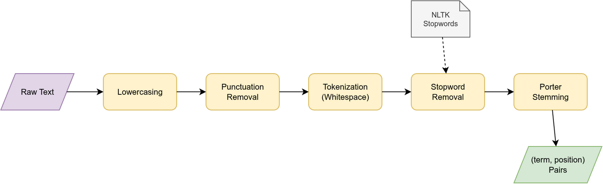

处理流水线为：

$$\text{Raw Text} \xrightarrow{\text{lowercase}} \xrightarrow{\text{remove punct}} \xrightarrow{\text{tokenize}} \xrightarrow{\text{remove stopwords}} \xrightarrow{\text{Porter stem}} \text{(term, position)}$$

#### 3.3.2 预处理方法

1. **小写化**：将所有字母转为小写，消除大小写差异。
2. **去标点**：使用正则表达式 `[^\w\s]` 去除非字母数字字符。
3. **分词**：基于空白字符分割文本。
4. **去停用词**：使用 NLTK 提供的 198 个英文停用词表过滤高频功能词。
5. **Porter 词干提取**：将词汇还原为词干形式（如 "aerodynamics" → "aerodynam"）。

关键设计：去停用词后，词项的位置编号保持原始值不重新编号。这是因为短语查询需要通过位置差值判断词项是否连续出现，重新编号会破坏位置关系。

核心代码：

```python
class Preprocessor:
    def __init__(self):
        self.stemmer = PorterStemmer()
        self.stop_words = set(stopwords.words("english"))
        self.punct_re = re.compile(r"[^\w\s]")

    def process(self, text: str) -> list[tuple[str, int]]:
        tokens = self.tokenize(text)
        result = []
        for pos, token in enumerate(tokens):
            if token not in self.stop_words and len(token) > 1:
                stemmed = self.stemmer.stem(token)
                result.append((stemmed, pos))
        return result
```

#### 3.3.3 预处理结果分析

经预处理后，数据集包含 4682 个唯一词项，文档平均长度为 100.7 个词项。图 3 展示了词频的 Zipf 分布，图 4 展示了文档频率的分布，图 5 展示了文档长度的分布，图 6 展示了出现频率最高的 20 个词项。

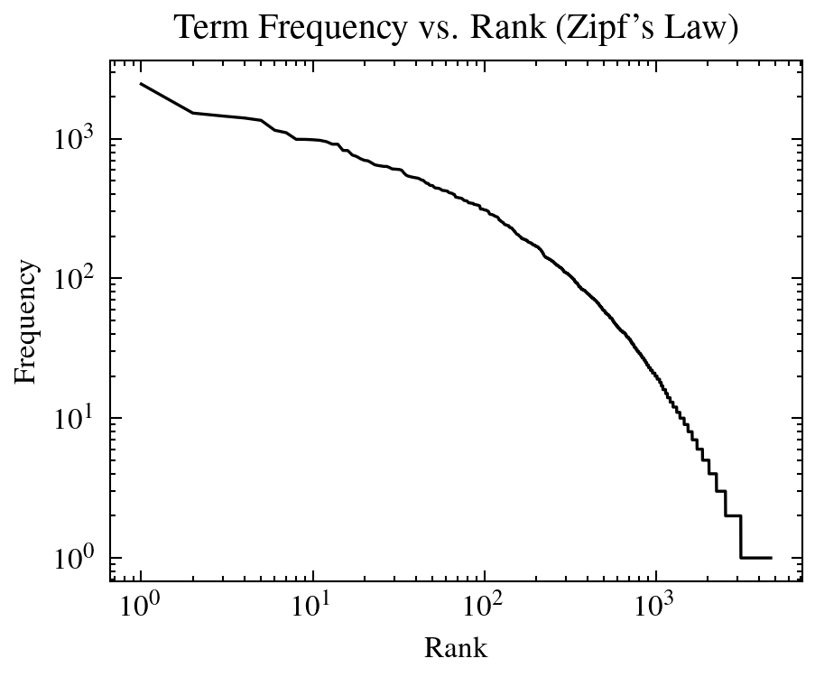

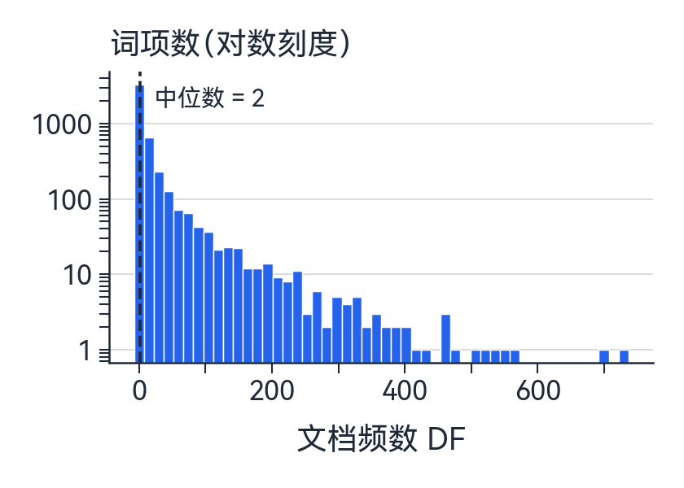

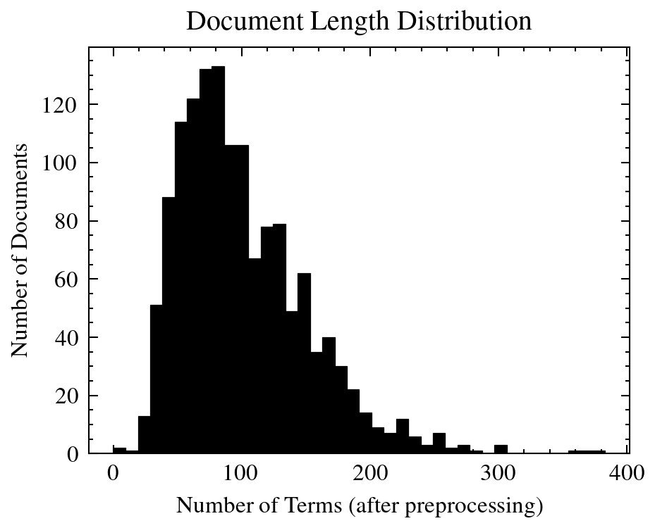

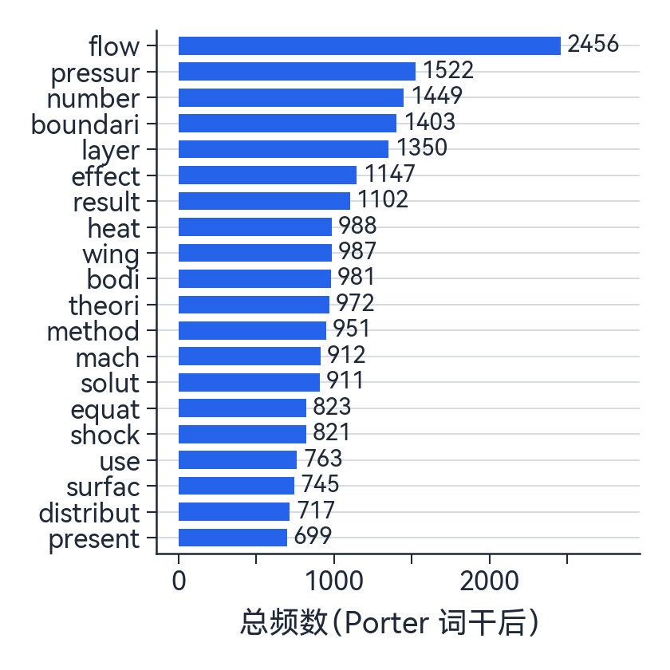

从图 3 可以看出，词频分布近似符合 Zipf 定律，即少量词项具有极高的频率，而大量词项仅出现一两次。从图 4 可以看出，绝大多数词项的文档频率集中在低值区间（中位数 DF = 2），说明词项具有较好的区分度。

### 3.4 倒排记录表的构建

#### 3.4.1 倒排索引功能

倒排索引是搜索引擎的核心数据结构[10]。本系统构建的倒排索引不仅记录每个词项出现在哪些文档中，还记录其在文档中的具体位置，以支持短语查询。

索引的数据结构为：

```
inverted_index: dict[str, dict[int, list[int]]]
# term → {doc_id → [position_0, position_1, ...]}
```

示例：词项 "aerodynam"（"aerodynamics" 的词干）在文档 1 的位置 4 和 15 出现，在文档 5 的位置 73 出现：

```
"aerodynam": {
    1: [4, 15],
    5: [73],
    ...
}
```

#### 3.4.2 构建核心代码

```python
class InvertedIndex:
    def build(self, documents: list[Document]):
        self.total_docs = len(documents)
        for doc in documents:
            self.documents[doc.doc_id] = doc
            full_text = doc.title + " " + doc.text
            tokens = self.preprocessor.process(full_text)
            self.doc_lengths[doc.doc_id] = len(tokens)
            for term, pos in tokens:
                if term not in self.index:
                    self.index[term] = {}
                if doc.doc_id not in self.index[term]:
                    self.index[term][doc.doc_id] = []
                self.index[term][doc.doc_id].append(pos)
```

构建完成后，索引通过 Python `pickle` 序列化缓存到磁盘，后续启动时直接加载，避免重复构建。

### 3.5 布尔检索与短语查询

#### 3.5.1 布尔检索

布尔检索支持 AND（交集）、OR（并集）、NOT（补集）三种运算符以及括号嵌套。系统采用递归下降解析器实现查询解析，其语法定义为：

```
expression := or_expr
or_expr    := and_expr ('OR' and_expr)*
and_expr   := not_expr ('AND' not_expr)*
not_expr   := 'NOT' not_expr | atom
atom       := '(' expression ')' | TERM
```

布尔检索流程如图 7 所示。

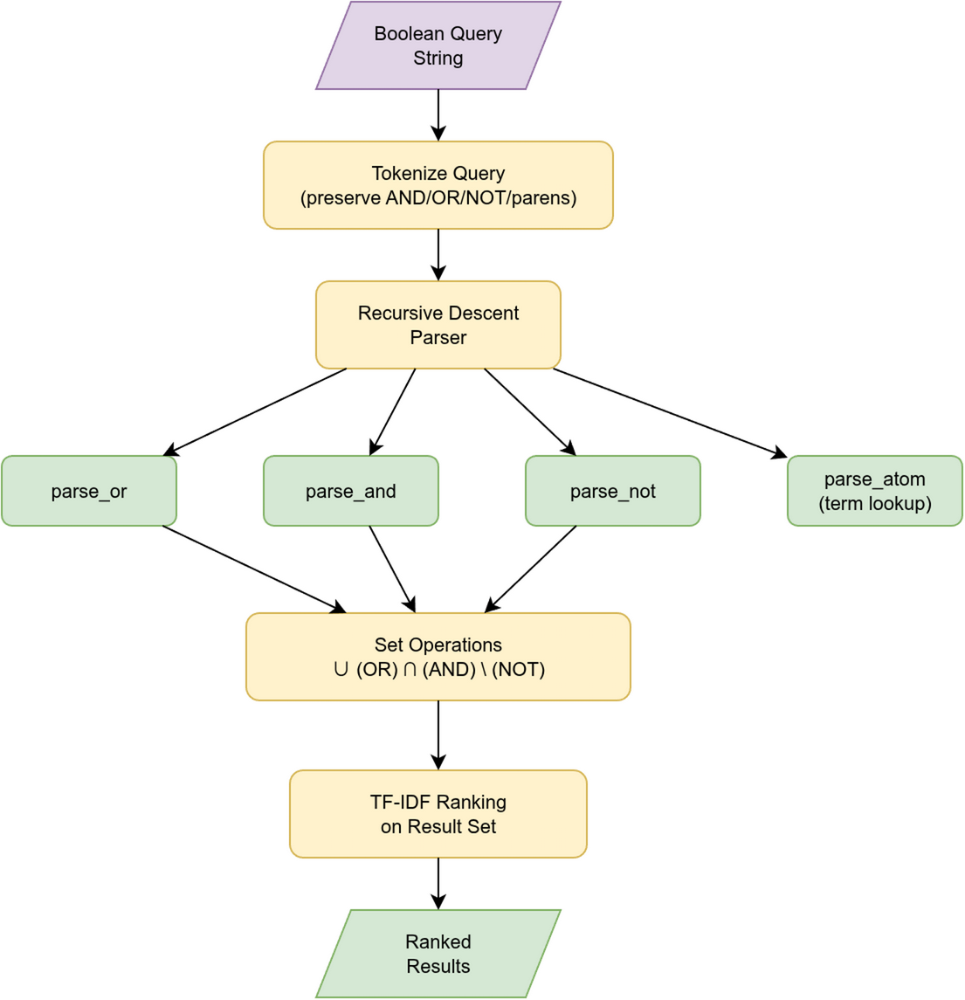

核心代码（以 AND 运算的解析为例）：

```python
def _parse_and(self, tokens, pos):
    left, pos = self._parse_not(tokens, pos)
    while pos < len(tokens) and tokens[pos].upper() == "AND":
        pos += 1
        right, pos = self._parse_not(tokens, pos)
        left = left & right  # 集合交集
    return left, pos
```

布尔检索得到的文档集合随后通过 TF-IDF 余弦相似度进行排序，使结果按相关度降序排列。

#### 3.5.2 短语查询

短语查询要求查询中的词项在文档中按相同顺序连续出现。其实现依赖倒排索引中的位置信息，流程如图 8 所示。

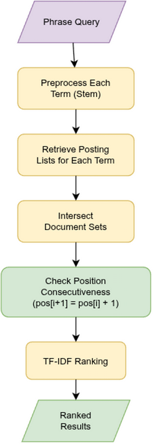

算法步骤：

1. 对短语中每个词做词干提取。
2. 获取各词项的倒排记录。
3. 取所有词项共同出现的文档集（交集）。
4. 在候选文档中检查位置连续性：第 $i+1$ 个词项的位置应等于第 $i$ 个词项的位置加 1。

核心代码：

```python
def _check_positions(self, doc_id, postings_list):
    first_positions = postings_list[0][doc_id]
    position_sets = [
        set(postings_list[i][doc_id])
        for i in range(1, len(postings_list))
    ]
    for start_pos in first_positions:
        match = True
        for i, pos_set in enumerate(position_sets, 1):
            if start_pos + i not in pos_set:
                match = False
                break
        if match:
            return True
    return False
```

### 3.6 文档评分

本系统采用 TF-IDF 向量空间模型对检索结果进行排序。对于每个词项 $t$，其在文档 $d$ 中的权重计算采用对数 TF 乘以 IDF：

$$w_{t,d} = (1 + \log_{10} f_{t,d}) \times \log_{10} \frac{N}{df_t}$$

系统预计算所有文档的 TF-IDF 向量模长，查询时仅需计算点积并归一化：

```python
def _rank(self, query_terms, doc_ids, top_k):
    # 计算查询向量权重
    for term in set(query_terms):
        if term in self.index.index:
            tf = 1 + math.log10(query_terms.count(term))
            idf = math.log10(self.N / len(self.index.index[term]))
            query_weights[term] = tf * idf

    # 累加文档-查询点积
    for term, q_weight in query_weights.items():
        for doc_id, positions in self.index.index[term].items():
            tf = 1 + math.log10(len(positions))
            d_weight = tf * idf
            scores[doc_id] += q_weight * d_weight

    # 余弦归一化
    for doc_id, dot_product in scores.items():
        cosine = dot_product / (query_norm * doc_norms[doc_id])
        results.append((doc_id, cosine))
```

### 3.7 查询扩展

查询扩展通过添加与原始查询词语义相关的词项来提高检索的召回率[10]。本系统基于 WordNet 词汇数据库实现同义词扩展。

对于查询中的每个词项，系统从 WordNet 中提取其同义词集（Synsets），筛选出词干不同于原词的同义词，最多保留用户指定数量的同义词（默认 3 个）。

示例：查询 "heat transfer" 的扩展结果为：
- heat → warmth, hotness, passion
- transfer → transferral, transport, conveyance

扩展后的所有词项（包括原始词和同义词）经词干提取后共同参与 TF-IDF 检索。

核心代码：

```python
def expand(self, query_terms, max_synonyms=3):
    for term in query_terms:
        synonyms = set()
        for synset in wordnet.synsets(term):
            for lemma in synset.lemmas():
                synonym = lemma.name().lower().replace("_", " ")
                if " " not in synonym and synonym != term:
                    stemmed = self.preprocessor.stemmer.stem(synonym)
                    if stemmed != self.preprocessor.stemmer.stem(term):
                        synonyms.add(synonym)
        expansion_map[term] = list(synonyms)[:max_synonyms]
```

### 3.8 Web 界面设计

系统前端采用 Vue 3 框架构建单页应用，通过 Axios 调用后端 RESTful API。Vite 开发服务器将 `/api` 请求代理至后端。

界面包含四个主要页面：

1. **布尔检索页面**：提供 AND/OR/NOT 操作符按钮辅助输入，搜索结果按余弦相似度排序，匹配词项黄色高亮。
2. **短语查询页面**：用户输入连续短语，系统查找包含该短语的文档。
3. **查询扩展页面**：展示同义词映射关系（原词 → 同义词列表），用户可调节同义词数量。
4. **词典浏览页面**：分页展示词典（词项、文档频率、总词频），可点击查看任意词项的完整倒排记录表（文档 ID、词频、位置列表）。

图 9 为布尔检索界面，用户输入 `aerodynamics AND wing NOT flutter`，系统返回 70 条结果，匹配词项以黄色高亮显示，结果按余弦相似度降序排列。

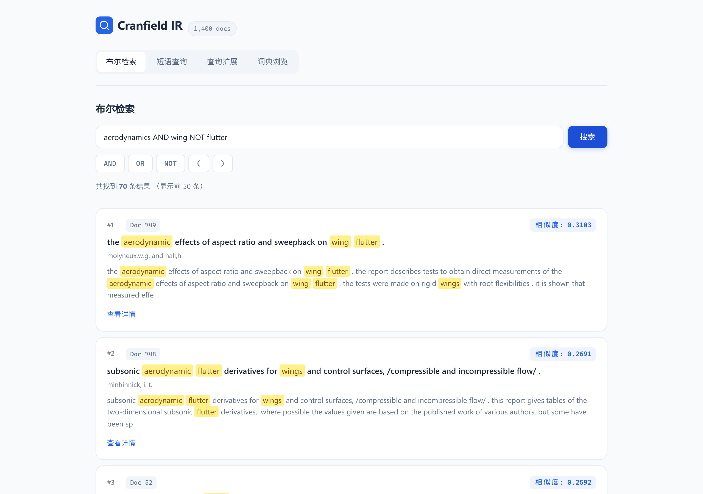

图 10 为短语查询界面，查询 `boundary layer`，系统通过位置信息匹配到 367 篇包含该短语的文档。

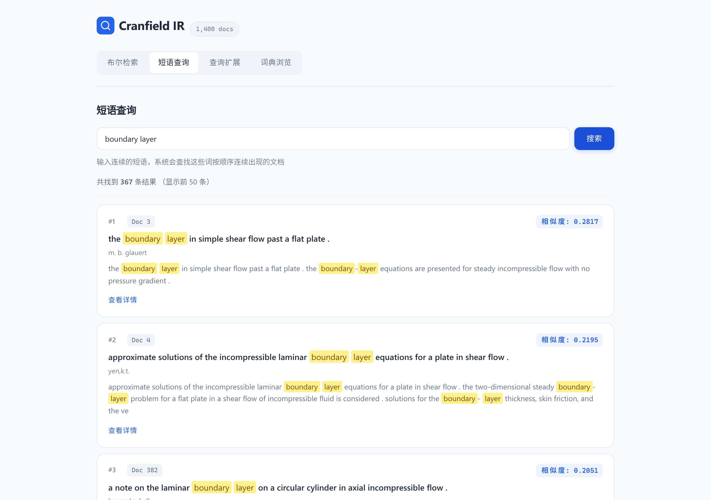

图 11 为查询扩展界面，输入 `heat transfer` 后，系统展示 WordNet 同义词映射（如 heat → hotness, warmth；transfer → transport, transferral），并使用扩展后的词项集合进行检索。

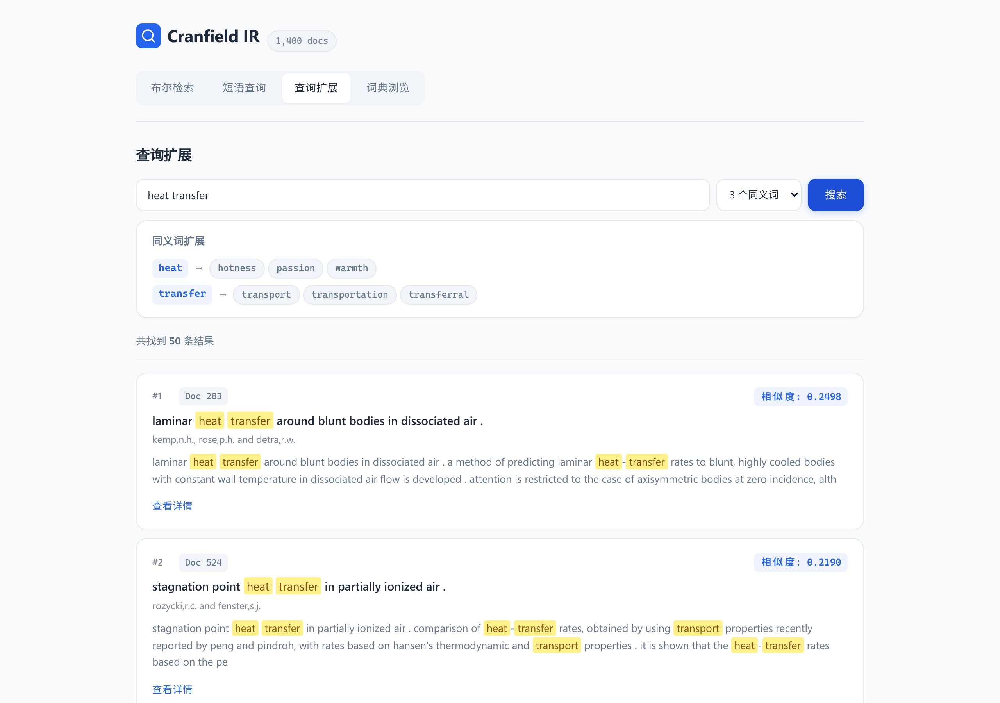

图 12 为词典浏览界面，按前缀 "aero" 筛选后展示相关词项，点击 "aerodynam"（DF=179）可查看其完整倒排记录表，包括文档 ID、词频和位置列表。

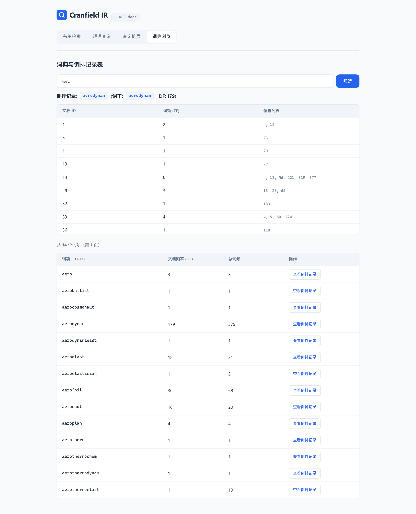

图 13 为文档详情展开视图，展示文档的完整标题、作者、出处和正文内容，匹配词项高亮显示。

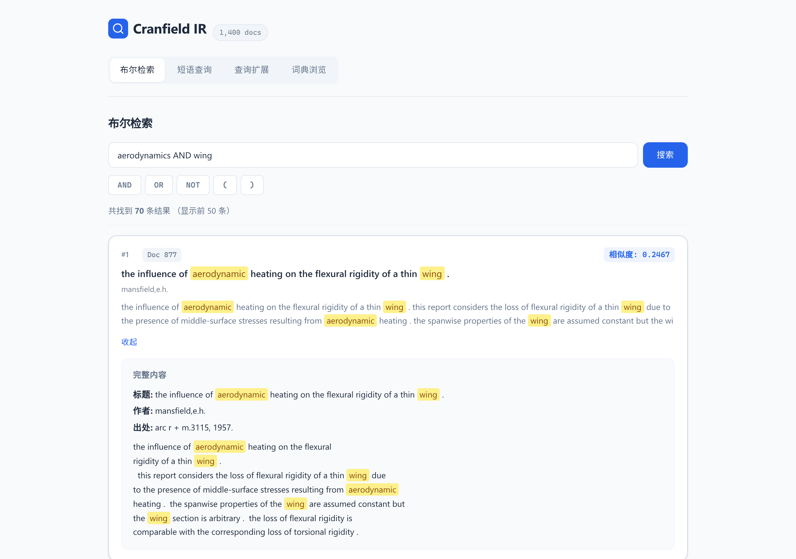

---

## 4 课程设计体会

通过本次课程设计，我们将《智能信息检索》课程中学习的布尔模型、向量空间模型、TF-IDF 权重计算、余弦相似度、倒排索引等理论知识付诸实践。在实现过程中，我们对以下几点有了更深刻的理解：

1. **位置索引的重要性**：实现短语查询时，仅凭词项的文档频率信息不够，必须记录词项在文档中的位置。去停用词后不重新编号位置是一个容易忽视的细节。

2. **词干提取的一致性**：索引构建和查询处理必须使用相同的词干提取算法（Porter Stemmer），否则查询词无法匹配索引中的词项。

3. **布尔检索与排序的结合**：纯布尔模型不支持结果排序，将布尔过滤与 TF-IDF 排序结合是实际搜索引擎的常见做法。

4. **查询扩展的双刃性**：同义词扩展可以提高召回率，但也可能引入语义漂移。例如 "heat" 的同义词 "passion" 在航空动力学领域并不相关。

5. **前后端分离的工程价值**：将检索逻辑封装为 API，前端负责交互和展示，使系统各模块可以独立开发和测试。

---

## 参考文献

[1] 印鉴, 陈忆群, 张钢. 搜索引擎技术研究与发展[J]. 计算机工程, 2005, 31(14): 1-3.

[2] Manning C D, Raghavan P, Schütze H. Introduction to Information Retrieval[M]. Cambridge University Press, 2008.

[3] Seymour T, Frantsvog D, Kumar S. History of Search Engines[J]. International Journal of Management & Information Systems, 2011, 15(4): 47-58.

[4] Brin S, Page L. The Anatomy of a Large-Scale Hypertextual Web Search Engine[J]. Computer Networks and ISDN Systems, 1998, 30(1-7): 107-117.

[5] Liu T Y. Learning to Rank for Information Retrieval[J]. Foundations and Trends in Information Retrieval, 2009, 3(3): 225-331.

[6] Devlin J, Chang M W, Lee K, et al. BERT: Pre-training of Deep Bidirectional Transformers for Language Understanding[C]. NAACL-HLT, 2019: 4171-4186.

[7] 李晓明, 刘建国. 搜索引擎技术及趋势[J]. 电脑与电信, 2008(5): 82-84.

[8] Karpukhin V, Oguz B, Min S, et al. Dense Passage Retrieval for Open-Domain Question Answering[C]. EMNLP, 2020: 6769-6781.

[9] Lewis P, Perez E, Piktus A, et al. Retrieval-Augmented Generation for Knowledge-Intensive NLP Tasks[C]. NeurIPS, 2020: 9459-9474.

[10] Manning C D, Raghavan P, Schütze H. 信息检索导论[M]. 王斌, 译. 人民邮电出版社, 2010.

[11] Salton G, Wong A, Yang C S. A Vector Space Model for Automatic Indexing[J]. Communications of the ACM, 1975, 18(11): 613-620.

[12] Spärck Jones K. A Statistical Interpretation of Term Specificity and Its Application in Retrieval[J]. Journal of Documentation, 1972, 28(1): 11-21.

[13] Robertson S E. The Probability Ranking Principle in IR[J]. Journal of Documentation, 1977, 33(4): 294-304.

[14] Robertson S E, Walker S. Some Simple Effective Approximations to the 2-Poisson Model for Probabilistic Weighted Retrieval[C]. SIGIR, 1994: 232-241.

[15] Cleverdon C W. The Cranfield Tests on Index Language Devices[J]. Aslib Proceedings, 1967, 19(6): 173-194.
